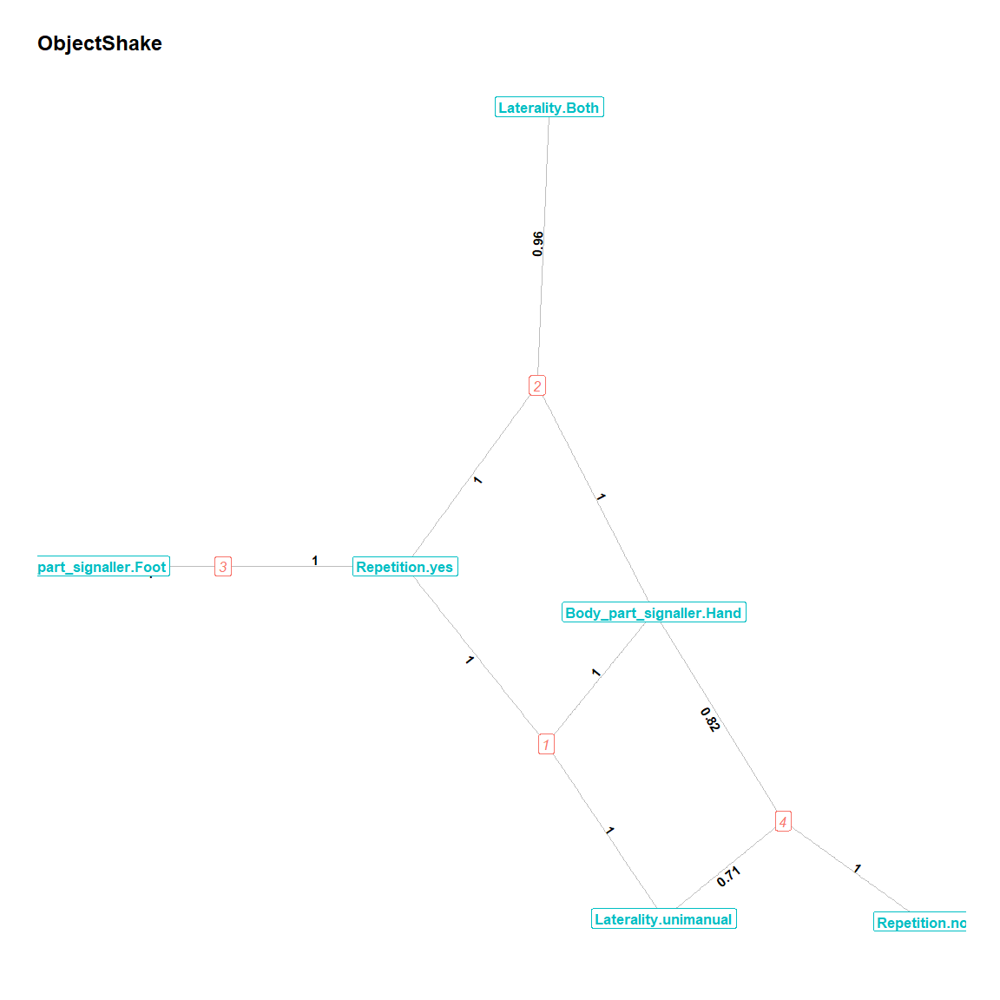
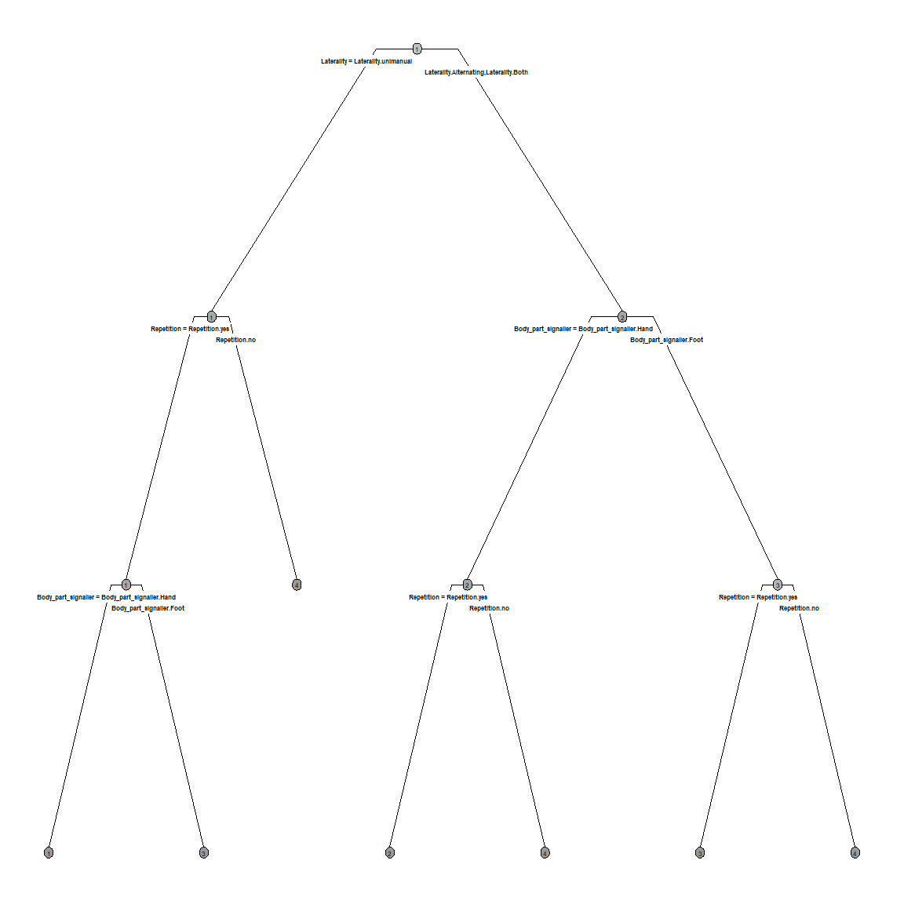
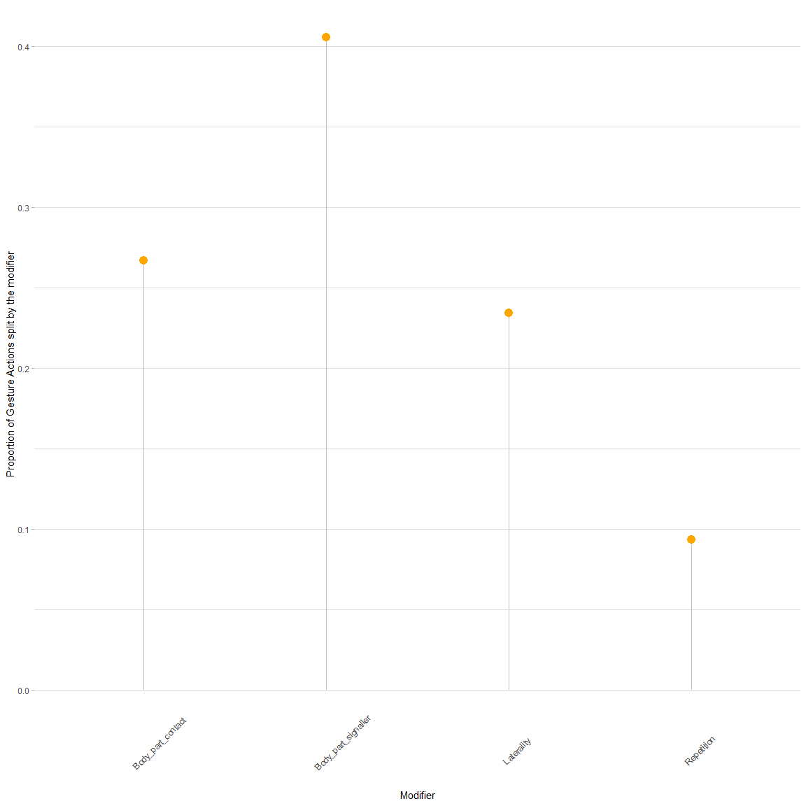
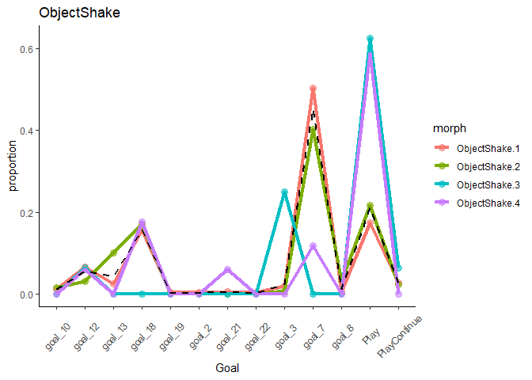
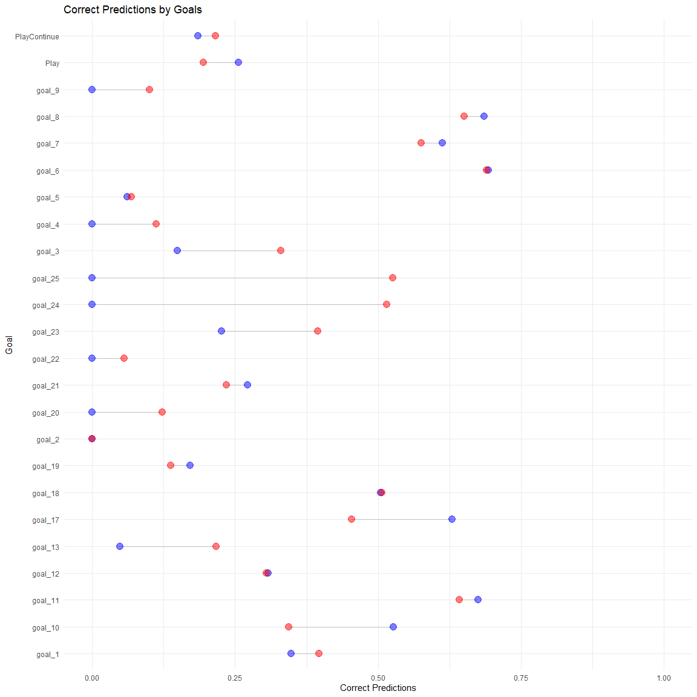

# Morph Repertoire Tutorial
Alex Mielke, Cat Hobaiter
Invalid Date

# Rationale

We are trying to establish a repertoire that provides a useful level of
analysis for exploring ape gesture use, one that parses the gestures
into units that are relevant to the apes, and one that allows us to
describe meaning and explore possible syntax, given the data coded by
the Wild Minds Lab. We recognise that other levels of repertoire are
possible. For example more fine grained splitting of morphs
incorporating more descriptive features, may allow use to explore tone
or emphasis. Importantly, there is no ‘true’ repertoire, as long as we
cannot ask the chimpanzees which particles of information they process -
we can generate different repertoires of different levels of detail and
judge them by their usefulness and internal consistency. By generating
the most fine-grained repertoire yet, we can subsequently lump and split
depending on the dataset and question at hand. Essentially, for any
given level of analysis, we have to show that every ‘gesture’ in the
coding scheme is exactly one gesture, and that no two distinct gestures
are actually one gesture. Here, we focus on the first part of that
question: are coded gestures actually one gesture and not several very
similar ones, distinguished by some modifying feature?

To move away from a purely *a priori,* human-centred approach, the
coding scheme used by the lab has been changed to not only include a
*gesture action* (the movement pattern that lets human observers detect
the gesture), but also a large number of modifying parameters or
*modifiers.* These specify more detailed aspects of each movement (e.g.,
which limb was used, how far the limb was stretched, etc). The challenge
now is to establish whether there are clustered combinations of gesture
actions and modifiers that would indicate a current gesture action is
indeed two gestures: for example, *arm raise* with one arm vs *arm
raise* with both arms. We will refer to the combination of gesture
action and modifiers as **Gesture Morphs**. We will attempt identifying
morphs that could indicate meaningful variation within a gesture action
without referring to the meaning/goal of gestures, and also without
referring to sequential information, because those will be the outcome
variables for later projects - if we involve them here, the risk is our
reasoning becomes tautological.

# Approach

There are currently around 110 gesture actions in the coding scheme and
probably about 8-12 modifiers of interest, many with multiple possible
levels. This would leave us with potentially an astronomically high
number of combinations. One problem we face is that many modifiers are
only defined for a small subset of gesture actions - we therefore need
rules that are gesture action specific. We will set exclusion rules for
both gesture actions and modifiers. We are trying to create reproducible
and replicable definitions of the gesture repertoire, and the dataset
for this project continues to expand.

## A note on the dataset

Here, we are working with a pre-processed and ‘anonymised’ dataset.
‘Anonymised’ here means that the gesture actions have numbers rather
than names, except for Play because it is relevant for some analyses to
distinguish it. This is suboptimal - we would prefer to present all
steps from raw data to morph to allow other researchers to replicate
those early steps as well (which are often the source of impactful
researcher degrees of freedom). However, there was a conflict of
interest between following Open Science best practices and the projects
of several of the co-authors. Thus, we will present the analytical steps
assuming the most of pre-processing has taken place, and gesture action
names are altered to prevent publishing the entire database ahead of
schedule.

## Ruleset

All rules will be based on probabilities (unconditional and conditional)
and comparisons between observed and expected probability distributions.
We have to set a cutoff value throughout - how many cases of a modifier
level do we have to see to assume we are not simply looking a random
variation or coding error? Here, we set the cutoff at for now. This can
be varied to check replicability of this decision.

### Exclusion rules for gesture actions

Gesture actions are only excluded if fewer than 10 cases are available
for the gesture action. We included this threshold because we
essentially cannot make meaningful statements about the reliability of
any morph assignment to these gesture actions, so they represent noise.
A list of these can be found below.

### Exclusion rules for modifiers

Modifier levels are excluded within gesture actions if they occur fewer
than 5 times. They are initially lumped into an ‘Other’ category, but if
this category fails to reach 5 cases, it’s set to NA. Modifiers are
excluded from analysis within gesture actions if there is no variation
in them.

# Data Cleaning

## Get Data and Scripts

``` r
devtools::load_all("~/GitHub/Morph_Repertoire/wildminds/R/")
```

### Read data into object

First, we read the dataset into an object called ‘gesture.data’. This
contains the pre-processed and ‘anonymised’ data.

``` r
gesture.data <- paper.data
```

### Remove rare gesture actions

Many gesture actions occur at very low frequencies; for example, 19
gesture actions occur fewer than 10 times in this particular dataset.
Trying to establish variation within those would be fairly difficult and
hard to justify; thus, we restrict our dataset to gesture actions that
have at least 10 occurrences. The following gesture action are removed:

``` r
(gesture.data$Gesture_record %>% 
                   table)[gesture.data$Gesture_record %>% 
                            table < 
                            cutoff_action] %>% 
  data.frame() %>% 
  rename('Gesture_record' = '.') %>% 
  rename('Frequency' = 'Freq')  %>% 
  kable(format = 'pipe', 
        row.names = NA,
        align = "c",
        booktabs = T, 
        digits = 0) %>% 
  kable_styling(font_size = 12)
```

|  Gesture_record  | Frequency |
|:----------------:|:---------:|
| gesture_token_12 |     3     |
| gesture_token_14 |     1     |
| gesture_token_18 |     1     |
| gesture_token_23 |     7     |
| gesture_token_25 |     2     |
| gesture_token_27 |     1     |
| gesture_token_28 |     2     |
| gesture_token_30 |     1     |
| gesture_token_34 |     3     |
| gesture_token_46 |     7     |
| gesture_token_47 |     9     |
| gesture_token_50 |     6     |
| gesture_token_56 |     1     |
| gesture_token_57 |     6     |
| gesture_token_59 |     6     |
| gesture_token_6  |     1     |
| gesture_token_60 |     6     |
| gesture_token_61 |     5     |
| gesture_token_7  |     3     |

``` r
gesture.data <-
  gesture.data %>%
  filter(Gesture_record %in%
           names(gesture.data$Gesture_record %>%
                   table)[gesture.data$Gesture_record %>%
                            table >=
                            cutoff_action])
```

This leaves us with 42 instead of 61 gesture actions.

``` r
g.data <- gesture.data %>% 
  select(
    # gesture action
    Gesture_record,
    # modifiers
    Body_part_signaller,
    Body_part_contact,
    Repetition,
    Laterality)
```

After this, g.data has still 420 unique gesture action/modifier set
combinations. That’s probably too many to build morphs from directly,
because no analyses would be able to process this given the datasets we
have. Therefore, we need reliable ways to reduce the information to a
manageable set of morphs.



# Analysis

## Create probabilities within gesture actions

Let’s calculate the basic probabilities of each modifier level within
each gesture action. Please note that all probabilities are dependent on
the modifier being used and any value being assigned; thus, if we have a
gesture action where *Body_part_signaller* was 4 times *NA*, 2 times
‘Leg’, and 2 times ‘Torso’, each of the latter two has a probability of
0.5. The ‘probability_table’ function creates a table that summarises
for each gesture action and each modifier which level was chosen at what
probability. Probabilities should sum up to one within gesture actions
and modifiers - all chosen body parts within *Beckon* should sum to the
entirety of times any body part could be identified.

``` r
prob.table <- probability_table(data = g.data, 
                                modifiers = colnames(g.data)[-1])

one_way_gestures <- prob.table %>%
  filter(count > 0) %>% 
  group_by(gesture_action) %>% 
  summarise(mean.prob = mean(probability)) %>%
  ungroup() %>% 
  filter(mean.prob == 1) %>% 
  select(gesture_action) %>% 
  unlist %>% as.vector

print(one_way_gestures)
```

     [1] "gesture_token_21" "gesture_token_26" "gesture_token_29" "gesture_token_31"
     [5] "gesture_token_4"  "gesture_token_42" "gesture_token_43" "gesture_token_48"
     [9] "gesture_token_49" "gesture_token_5"  "gesture_token_55" "gesture_token_8" 

Looking at the list, there are currently 12 gesture actions that only
ever occur in one particular way. Those amount to 28.571% of all gesture
actions in the dataset.



## Cluster Detection Algorithms

The main problem with using the probabilities to narrow down the gesture
action/modifier combinations is that each gesture event can be classed
in multiple categories: if *arm raise* differs by repetition (yes/no)
and by laterality (one arm/two arms), then is a case where two arms are
repeatedly raised an example of *arm raise - repetition* or *arm raise -
two arms*? This would be a real challenge for a repertoire - we
optimally want a solution that assigns each instance exactly one
gesture. We could split it four ways (e.g., one arm/no repetition, two
arms/no repetition, one/yes, two/yes), but this leaves us with very few
cases for many of the combinations.

A way to solve this is to use clustering algorithms to find
statistically meaningful hidden underlying or ‘latent’ classes. We could
identify those, see if they provide us with clear reproducible rules how
to split a gesture action into morphs, and then determine whether the
morphs are useful. This approach could potentially reduce a lot of
variation that we as humans cannot meaningfully handle. The main problem
is that the clustering algorithms are often rather opaque - we do not
always understand why the split occurred the way it. However, we can
identify how the different modifier levels fall into detected clusters
and find those modifier levels that have both a very high probability of
occurring in the cluster (hopefully 1) and a very high specificity to
this cluster (they occur in this cluster and this cluster only).
Modifiers that occur at high probability only in all clusters
(probability = 1, specificity = low) are not very informative; neither
are modifiers that have high specificity but low probability. Thus, we
are trying to find those modifiers that occur in all cases of a cluster,
and differentiate that cluster from others.

Computationally, we use Bayesian Latent Class Analysis
(https://www.ncbi.nlm.nih.gov/pmc/articles/PMC6364555/) to detect latent
classes in the categorical data that are the modifiers. LCA is a
model-based cluster detection approach (in contrast to, say, k-means,
which is heuristic) - the model quantifies the best split of data given
a certain number of assumed clusters and gives us a AIC or BIC value
that quantifies the likelihood that the clustering correctly describes
some underlying cluster. By repeating the process with multiple cluster
sizes and comparing AICs/BICs, we can find the cluster solution that
describes the data with the smallest amount of error. We make a second
assumption, which is that the best solution is one that only has
clusters comprised of at least 5 cases, our cutoff value.

Here is an example, using *ObjectShake*. Using the probabilistic
approach earlier, we found that *ObjectShake* is differentiated by the
body part used (Hand vs Leg), the Laterality (Alternating vs Both vs
unimanual) and whether the gesture was repeated or not. This would
potentially create a rather large number of possible gestures to split
into, which is something we want to avoid.

``` r
xx.OS = morph_detection_bayes(
  data = g.data,
  modifiers = colnames(g.data)[-1],
  gesture_action = colnames(g.data)[1],
  plot.action = 'ObjectShake',
  cutoff = cutoff_overall)
```

The current best cluster solution contains 4 clusters. These are best
represented by the following modifiers, which have both high probability
of occurring in this cluster (probability = 1) and high specificity by
not occurring in any of the other clusters (specificity = 1).

``` r
xx.OS$cluster.info %>% 
  filter(probability == 1 & 
           specificity == 1) %>% 
  kable(format = 'pipe',
        row.names = NA,
        align = "c",
        booktabs = T) %>% 
  kable_styling(font_size = 9)
```

|                           modifier                           | count.cluster | probability | specificity | nr.rules | cluster | gesture_action |
|:------------------------------------------------------------:|:-------------:|:-----------:|:-----------:|:--------:|:-------:|:--------------:|
| Body_part_signaller.Hand:Laterality.unimanual:Repetition.yes |      402      |      1      |      1      |    3     |    1    |  ObjectShake   |
|                        Repetition.no                         |      17       |      1      |      1      |    1     |    4    |  ObjectShake   |
|           Body_part_signaller.Foot:Repetition.yes            |      18       |      1      |      1      |    2     |    3    |  ObjectShake   |

Using a network graph, we can visualise the connections between morphs
and different modifiers.

``` r
plot_bipartite(
  prob.table = xx.OS$cluster.info %>% filter(nr.rules == 1),
  select.modifier = "cluster",
  plot.title = 'ObjectShake',
  cutoff = cutoff_overall,
  threshold = 0
)
```



This approach reduces a lot of the variation compared to the previous
approach. The hierarchical way of splitting the gesture cases means that
each gesture case is assigned to exactly one category while the number
of different clusters is held to a minimum.

``` r
rpart.plot(
      xx.OS$tree,
      type = 4,
      fallen.leaves = FALSE,
      cex = 0.5,
      extra = 0,
      box.palette = "Greys"
    ) %>%
      suppressWarnings()
```



The clustering approach often leads to a relatively large number of
clusters, but it is hard to establish which of these morphs is
potentially an independent source of information and which of them are
potentially just random variation that we introduce by having a detailed
coding scheme. While we try to exclude Meaning as a variable of interest
as much as possible in this analysis, it is worth keeping it in mind
because it will ultimately be the variable that decides whether two
morphs are meaningfully distinct. There are two ways of finding out
which of the morphs are important: first, we can establish which
modifiers could potentially contain relevant information by testing
whether knowledge of the modifier reduces uncertainty about the meaning
of the gesture action very broadly. We would do that by testing whether
the entropy/uncertainty about which Goal the gesture was assigned to is
reduced if the modifier is known (vs randomised). We could then
calculate clusters based only on modifiers for which we have an
indication that they contain relevant information about Meaning.
Alternatively, we use the same approach, but we first determine the
clusters using the maximum set of modifiers, and then test whether any
of the morphs differ from expected with regard to their meaning. We will
present both approaches below for *ObjectShake*.

``` r
# use modifier_entropy function to detect which modifiers give us any information about the meaning of the gesture action
entropy.OS = modifier_entropy(
  data = g.data,
  modifiers = colnames(g.data)[-1],
  gesture_action = colnames(g.data)[1],
  plot.action = 'ObjectShake',
  cutoff = cutoff_overall,
  remove_unknown = TRUE,
  target = gesture.data$Goal)

entropy.OS %>% 
  select(modifier,
         level,
         count,
         entropy.observed,
         entropy.expected,
         pvalue.entropy) %>% 
  kable(format = 'pipe', 
        row.names = NA,
        align = "c",
        booktabs = T, 
        digits = 2) %>% 
  kable_styling(font_size = 10)
```

|      modifier       |          level           | count | entropy.observed | entropy.expected | pvalue.entropy |
|:-------------------:|:------------------------:|:-----:|:----------------:|:----------------:|:--------------:|
| Body_part_signaller | Body_part_signaller.Hand |  524  |       1.61       |       1.64       |      0.00      |
| Body_part_signaller | Body_part_signaller.Foot |  19   |       0.90       |       1.38       |      0.01      |
|     Repetition      |      Repetition.yes      |  531  |       1.63       |       1.64       |      0.15      |
|     Repetition      |      Repetition.no       |  17   |       1.20       |       1.35       |      0.31      |
|     Laterality      |   Laterality.unimanual   |  389  |       1.55       |       1.63       |      0.00      |
|     Laterality      |     Laterality.Both      |  132  |       1.71       |       1.61       |      0.93      |
|     Laterality      |  Laterality.Alternating  |  10   |       1.28       |       1.24       |      0.59      |

``` r
# run the same entropy approach but for the clusters - does any of them reduce uncertainty?
entropy.OS.cluster = modifier_entropy(
  data = cbind(xx.OS$full.data,
               GA = rep('ObjectShake', nrow(xx.OS$full.data))),
  modifiers = 'cluster',
  gesture_action = 'GA',
  plot.action = 'ObjectShake',
  cutoff = cutoff_overall,
  target =
    gesture.data$Goal[gesture.data$Gesture_record == 'ObjectShake']
)

entropy.OS.cluster %>%
  select(modifier,
         level,
         count,
         entropy.observed,
         entropy.expected,
         pvalue.entropy) %>% 
  kable(format = 'pipe', 
        row.names = NA,
        align = "c",
        booktabs = T, 
        digits = 2) %>% 
  kable_styling(font_size = 10)
```

| modifier |   level   | count | entropy.observed | entropy.expected | pvalue.entropy |
|:--------:|:---------:|:-----:|:----------------:|:----------------:|:--------------:|
|    .     | cluster.1 |  402  |       1.69       |       1.75       |      0.02      |
|    .     | cluster.2 |  135  |       1.75       |       1.72       |      0.60      |
|    .     | cluster.4 |  17   |       1.20       |       1.45       |      0.17      |
|    .     | cluster.3 |  18   |       1.23       |       1.48       |      0.11      |

## Cluster Detection

What we will do next is essentially to run the cluster algorithm for all
gesture actions, compare them automatically with the probability based
solutions as much as possible and detect the ones for which we need to
check manually which solution would be appropriate. We consider the two
approaches to provide the same solution if the defining modifiers of the
clusters are the same that show variation with the probabilistic
approach, or if both indicate that there is only one cluster. Sometimes
clusters are not based on high probability and specificity of one
modifier, but a combination of two modifiers; where no one-modifier
solution exists, we will provide this information.

**Notes:**

- The code to run this in parallel and get all the information out is
  still quite messy.

- This currently takes about 12h to run on 8 cores

### Run cluster analysis for all gesture actions

``` r
gesture_clusters <- 
  parLapply(mycluster,# go through each gesture action independently
    X = unique(g.data$Gesture_record),
    function(y) {
      devtools::load_all("~/GitHub/Morph_Repertoire/wildminds/R/")   
      library(tidymodels)
      # set action
      action <- y
      # set cutoff
      cutoff.value <- cutoff_overall
      # select gesture action data
      ga.data <- g.data %>%
        filter(Gesture_record == action)
      # store additional info
      ga.identifier <- gesture.data %>%
        filter(Gesture_record == action) %>%
        select(Social_unit, 
               Goal)
      
      # make lca of modifiers
      ga.lca <- 
        morph_detection_bayes(
          data = ga.data,
          modifiers = colnames(ga.data)[-1],
          gesture_action = colnames(ga.data)[1],
          plot.action = action,
          cutoff = cutoff.value
        )
      
      return(ga.lca)
    }
  )

stopCluster(mycluster)

names(gesture_clusters) <- unique(g.data$Gesture_record)
```

### Extract useful information

``` r
cluster_solutions <-
  lapply(gesture_clusters,
            function(y) {
              devtools::load_all("~/GitHub/Gestures/R package/wildminds/R/")
              ga.lca <- y
              # set action
              action <- ga.lca$gesture.action
              # set cutoff
              cutoff.value <- cutoff_overall
              # select gesture action data
              ga.data <- g.data %>%
                filter(Gesture_record == action)
              # store additional info
              ga.identifier <- gesture.data %>%
                filter(Gesture_record == action) %>%
                select(Social_unit,
                       Goal)
              
              # make a list for summary information
              action.summary <- list()
              action.summary$gesture.action <- action
              action.summary$cutoff <- cutoff.value
              action.summary$count <- nrow(ga.data)
              
              # make probability table for this action
              action.summary$probability.table <-
                prob.table %>%
                filter(gesture_action == action) %>%
                filter(count > 0)
              
              # Check Entropy of goals
              ga.entropy.cluster = modifier_entropy(
                data = ga.lca$full.data %>%
                  mutate(GA = action),
                modifiers = 'cluster',
                gesture_action = 'GA',
                plot.action = action,
                cutoff = cutoff_overall,
                target = ga.identifier$Goal
              )
              
              # Check entropy of modifiers
              
              ga.entropy.modifiers = modifier_entropy(
                data = ga.data,
                modifiers = colnames(ga.data)[-1],
                gesture_action = colnames(ga.data)[1],
                plot.action = action,
                cutoff = cutoff_overall,
                target = ga.identifier$Goal
              )
              
              ### check group patterns
              ga.groups <-
                list(count =
                       table(
                         ga.identifier$Social_unit,
                         ga.lca$full.data$cluster,
                         dnn = c("Group", "Cluster")
                       ))
              
              ga.groups$probability <-
                t(t(ga.groups$count) /
                    colSums(ga.groups$count))
              
              ### Check Goal patterns
              ga.goals <- list(count =
                                 table(
                                   ga.identifier$Goal,
                                   ga.lca$full.data$cluster,
                                   dnn = c("Goal", "Cluster")
                                 ))
              ga.goals$probability <-
                t(t(ga.goals$count) /
                    colSums(ga.goals$count))
              
              
              ### if there is no cluster, return NAs
              if (ga.lca$distinction.info$nr.clusters == 1) {
                action.summary$cluster.solution.number <- 1
                action.summary$cluster.solution.options <- NA
                action.summary$cluster.solution <- NA
                action.summary$cluster.solution.important <- NA
                action.summary$cluster.solution.network <- NA
                action.summary$cluster.solution.tree <- NA
                action.summary$cluster.solution.tree.importance <-
                  NA
                action.summary$group.distribution <- ga.groups
                action.summary$goal.distribution <- ga.goals
                action.summary$full.data <- cbind(ga.data,
                                                  ga.identifier,
                                                  cluster = ga.lca$full.data$cluster)
                action.summary$morph.summary <- NA
                action.summary$entropy.modifiers <- NA
                action.summary$entropy.clusters <- NA
              }
              
              ### If clusters were detected, extract all possible info
              if (ga.lca$distinction.info$nr.clusters > 1) {
                # how many morphs?
                action.summary$cluster.solution.number <-
                  max(ga.lca$cluster.info$cluster %>%
                        as.numeric())
                # how many morphs could have been established?
                action.summary$cluster.solution.options <-
                  ga.lca$solutions
                
                # save individual modifier probability and specificity for morphs
                action.summary$cluster.info <-
                  ga.lca$cluster.info %>%
                  filter(probability > 0)
                
                # save modifiers and combinations that are highly predictive of morphs
                action.summary$cluster.solution.important <-
                  action.summary$cluster.info %>%
                  filter(probability == 1 & specificity == 1) %>%
                  select(modifier) %>%
                  unlist(use.names = FALSE) %>%
                  as.character()
                
                # make lca plot
                action.summary$cluster.solution.network <-
                  plot_bipartite(
                    prob.table = ga.lca$cluster.info %>% filter(nr.rules == 1),
                    select.modifier = "cluster",
                    plot.title = action,
                    cutoff = 0
                  )
                
                # make decision tree plot
                # get variable importance from decision tree
                action.summary$cluster.solution.tree.importance <-
                  ga.lca$tree.var.importance
                
                # save the different distributions by Goal, group, species etc
                action.summary$group.distribution <- ga.groups
                action.summary$goal.distribution <- ga.goals
                
                # save full dataset for later use, including addition info
                action.summary$full.data <-
                  cbind(ga.data, ga.identifier, cluster = ga.lca$full.data$cluster)
                
                # check rules for morphs
                
                summary_morphs <- list(
                  ## check which morphs significantly reduced entropy
                  ent.goals = ga.entropy.cluster %>%
                    filter(pvalue.entropy <= 0.05) %>%
                    select(level) %>%
                    unlist(F, F) %>%
                    str_replace('cluster.', ''),
                  ## check which morphs were group specific
                  distinct.group =
                    colnames(ga.groups$count)[ga.groups$probability %>%
                                                apply(2, max) ==
                                                1],
                  ## check which morphs were Goal specific
                  distinct.goal =
                    colnames(ga.goals$count)[ga.goals$probability %>%
                                               apply(2, max) ==
                                               1],
                  ## check which morphs were explained by one modifier level
                  distinct.probability.specificity =
                    ga.lca$cluster.info %>%
                    filter(probability == 1 &
                             specificity == 1) %>%
                    select(cluster) %>%
                    unlist(F, F) %>%
                    as.character() %>%
                    unique(),
                  # cluster count
                  cluster.count =
                    ga.lca$cluster.info %>%
                    distinct(cluster, .keep_all = TRUE) %>%
                    pull(count.cluster)
                )
                
                ## make a summary of the morphs
                morph_sum <- data.frame(cluster =
                                          sort(ga.lca$full.data$cluster %>%
                                                 unique())) %>%
                  mutate(
                    entropy.goal =
                      as.numeric(cluster %in%
                                   summary_morphs$ent.goals),
                    distinct.group =
                      as.numeric(cluster %in%
                                   summary_morphs$distinct.group),
                    distinct.goal =
                      as.numeric(cluster %in%
                                   summary_morphs$distinct.goal)
                  )
                
                # by which of those rules would the morph be considered 'clear'
                morph_sum$rules <-
                  sapply(1:nrow(morph_sum), function(x) {
                    xx <- morph_sum[x, -1]
                    return(paste(colnames(xx)[which(xx == 1)], collapse = ', '))
                  })
                
                morph_sum$gesture_action <- action
                
                # add to action.summary
                action.summary$morph.summary <- morph_sum
                action.summary$entropy.clusters <-
                  ga.entropy.cluster
                action.summary$entropy.modifiers <-
                  ga.entropy.modifiers
              }
              
              # save each run so I don't have to start over every time
              return(action.summary)
            })
```

### Extract from cluster summary

``` r
# name elements of list
names(cluster_solutions) <- 
  sapply(cluster_solutions, function(y) y$gesture.action)

# transpose to make more easily accessible
cluster_transposed <- purrr::transpose(cluster_solutions)

cluster_solution_summary <-
  data.frame(
    gesture.action = 
      unlist(cluster_transposed$gesture.action,
             use.names = FALSE),
    count = 
      unlist(cluster_transposed$count,
             use.names = FALSE),
    cluster.number = 
      unlist(cluster_transposed$cluster.solution.number,
             use.names = FALSE
      ),
    cluster.modifiers = sapply(
      cluster_transposed$cluster.solution.important, function(x) {
        if (length(x) == 0) {
          return(paste(""))
        }
        x %>%
          unlist() %>%
          str_split("\\.") %>%
          unlist() %>%
          unique() %>%
          intersect(colnames(g.data)) %>%
          sort() %>%
          paste(collapse = ", ")
      }
    )
  )

distinction.infos <- purrr::transpose(gesture_clusters)$distinction.info

distinction.infos[is.na(distinction.infos)] <- 
  rep(list(data.frame(nr.clusters = 1, 
                      nr.clusters.distinct = 1, 
                      nearest.neighbours = 3)), 
      length(distinction.infos[is.na(distinction.infos)]))

distinction.infos <- distinction.infos %>% 
  bind_rows() %>% 
  mutate(gesture_action = sapply(gesture_clusters, function(y) y$gesture.action)) %>% 
  select(gesture_action, nr.clusters, nr.clusters.distinct) %>% 
  mutate(nr.clusters.unclear = nr.clusters - nr.clusters.distinct)
```

In total, if we go purely with the cluster solution for each gesture
action, we would end up with a repertoire of in total 115 morphs,
ranging between 1 and 7 morphs per gesture action. For most gesture
actions, the morphs could be identified using a clear set of rules - for
40 of 42 gesture actions, all morphs are clearly defined. The morphs are
distributed the following way within the gesture actions:

``` r
sapply(purrr::transpose(gesture_clusters)$full.data, 
       function(x) max(x$cluster, na.rm = T)) %>% 
  unlist(F,F) %>% 
  table() %>%  
  t() %>%  
  data.frame() %>% 
  select(-Var1) %>% 
  rename('Number_of_moprhs' = '.',
         'Count' = 'Freq') %>% 
  kable(format = 'pipe', 
        row.names = NA,
        align = "c",
        booktabs = T) %>% 
  kable_styling(font_size = 9)
```

| Number_of_moprhs | Count |
|:----------------:|:-----:|
|        1         |  17   |
|        2         |   6   |
|        3         |   7   |
|        4         |   4   |
|        5         |   1   |
|        6         |   5   |
|        7         |   2   |

### Split Rules

If we look at the importance of different modifiers from the random
forest approach, get the following picture for those gesture actions
where splits occurred:

``` r
split_importance <- data.frame(variable = cluster_transposed$cluster.solution.tree.importance[
                                    sapply(sapply(cluster_transposed$cluster.solution.tree.importance, is.na), sum) != 1] %>% 
                                    sapply(names) %>% 
                                    unlist() %>% 
                                    unique() %>% 
                                    sort()
                              )

# Loop through each cluster and join the importance values to the split_importance data frame
for(i in seq_along(cluster_transposed$cluster.solution.tree.importance)){
  split_importance <- split_importance %>% 
    left_join(cluster_transposed$cluster.solution.tree.importance[[i]] %>% 
                data.frame(check.names = T) %>% 
                rownames_to_column(var = "variable") %>% 
                rename('importance' = '.') %>% 
                mutate(importance = importance/max(importance))) %>% 
    data.frame() %>% 
    suppressMessages()
  colnames(split_importance)[ncol(split_importance)] = names(cluster_transposed$cluster.solution.tree.importance)[i]
}

# Replace NAs with 0
split_importance[is.na(split_importance)] = 0

# Transpose the data frame and format it as a table
split_importance %>% 
  column_to_rownames('variable') %>% 
  t() %>% 
  data.frame() %>% 
  rownames_to_column(var = "variable") %>% 
  arrange(variable) %>% 
  column_to_rownames('variable') %>% 
  kable(format = 'pipe', 
        row.names = NA,
        align = "c",
        booktabs = T, 
        digits = 2) %>% 
  kable_styling(font_size = 9)
```

|                  | Body_part_contact | Body_part_signaller | Laterality | Repetition |
|:-----------------|:-----------------:|:-------------------:|:----------:|:----------:|
| ObjectShake      |       0.00        |        0.20         |    1.00    |    0.17    |
| gesture_token_1  |       0.00        |        1.00         |    0.00    |    0.00    |
| gesture_token_10 |       0.00        |        0.00         |    0.00    |    0.00    |
| gesture_token_11 |       1.00        |        0.00         |    0.70    |    0.00    |
| gesture_token_13 |       0.00        |        1.00         |    0.00    |    0.00    |
| gesture_token_15 |       1.00        |        0.00         |    0.22    |    0.00    |
| gesture_token_16 |       0.79        |        0.00         |    1.00    |    0.00    |
| gesture_token_17 |       0.00        |        0.00         |    0.00    |    0.00    |
| gesture_token_19 |       0.00        |        0.61         |    1.00    |    0.87    |
| gesture_token_2  |       1.00        |        0.00         |    0.00    |    0.00    |
| gesture_token_20 |       0.61        |        0.47         |    1.00    |    0.55    |
| gesture_token_21 |       0.00        |        0.00         |    0.00    |    0.00    |
| gesture_token_22 |       0.00        |        0.00         |    0.00    |    0.00    |
| gesture_token_24 |       0.00        |        1.00         |    0.00    |    0.00    |
| gesture_token_26 |       0.00        |        0.00         |    0.00    |    0.00    |
| gesture_token_29 |       0.00        |        0.00         |    0.00    |    0.00    |
| gesture_token_3  |       1.00        |        0.00         |    0.00    |    0.00    |
| gesture_token_31 |       0.00        |        0.00         |    0.00    |    0.00    |
| gesture_token_32 |       0.00        |        0.00         |    1.00    |    0.00    |
| gesture_token_35 |       0.00        |        0.00         |    0.00    |    0.00    |
| gesture_token_36 |       0.00        |        1.00         |    0.28    |    0.00    |
| gesture_token_37 |       0.00        |        1.00         |    0.00    |    0.00    |
| gesture_token_38 |       1.00        |        0.00         |    0.47    |    0.00    |
| gesture_token_39 |       1.00        |        0.62         |    0.17    |    0.00    |
| gesture_token_4  |       0.00        |        0.00         |    0.00    |    0.00    |
| gesture_token_40 |       0.00        |        1.00         |    0.37    |    0.00    |
| gesture_token_41 |       0.00        |        1.00         |    0.00    |    0.00    |
| gesture_token_42 |       0.00        |        0.00         |    0.00    |    0.00    |
| gesture_token_43 |       0.00        |        0.00         |    0.00    |    0.00    |
| gesture_token_44 |       0.54        |        0.88         |    0.00    |    1.00    |
| gesture_token_45 |       0.00        |        1.00         |    0.82    |    0.09    |
| gesture_token_48 |       0.00        |        0.00         |    0.00    |    0.00    |
| gesture_token_49 |       0.00        |        0.00         |    0.00    |    0.00    |
| gesture_token_5  |       0.00        |        0.00         |    0.00    |    0.00    |
| gesture_token_51 |       0.00        |        0.06         |    1.00    |    0.53    |
| gesture_token_52 |       0.93        |        0.00         |    0.50    |    1.00    |
| gesture_token_53 |       0.21        |        1.00         |    0.00    |    0.98    |
| gesture_token_54 |       0.00        |        1.00         |    0.00    |    0.00    |
| gesture_token_55 |       0.00        |        0.00         |    0.00    |    0.00    |
| gesture_token_58 |       1.00        |        0.50         |    0.01    |    0.00    |
| gesture_token_8  |       0.00        |        0.00         |    0.00    |    0.00    |
| gesture_token_9  |       0.00        |        0.00         |    0.00    |    0.00    |

If we plot the average impact of each modifier in gesture actions where
they occur (standardising the impact of all modifiers within gesture
actions by dividing by the sum of all of them, then taking the mean
across all non-NA occurrences of that modifier), we see that there are
clear differences in the importance of modifiers: body part contacted
and laterality seem to lead to clear splits across the gesture actions
in which they occur, while object involved barely matters (mainly
because the gesture actions are already split by object involved).

``` r
# create a data frame with the variables (modifiers) in the rows
xx <- split_importance %>%
  column_to_rownames('variable') %>%
  t() %>%
  data.frame() %>%
  rownames_to_column(var = "variable") %>%
  arrange(variable) %>%
  column_to_rownames('variable')

# normalize the rows of the data frame
xx <- xx / rowSums(xx, na.rm = T)

# calculate the mean impact of each modifier in the decision tree
colMeans(xx, na.rm = T) %>%
  data.frame() %>%
  rownames_to_column('modifier') %>%
  rename('Mean_Impact' = '.') %>%
  
  # create a ggplot object to visualize the results
  ggplot(aes(modifier, Mean_Impact)) +
  geom_segment(aes(
    x = modifier,
    xend = modifier,
    y = 0,
    yend = Mean_Impact
  ), color = "grey") +
  geom_point(color = "orange", size = 4) +
  theme_light() +
  theme(
    panel.grid.major.x = element_blank(),
    panel.border = element_blank(),
    axis.ticks.x = element_blank(),
    axis.text.x = element_text(
      angle = 45,
      vjust = 0.5,
      hjust = 0.2
    )
  ) +
  xlab("Modifier") +
  ylab("Proportion of Gesture Actions split by the modifier")
```



## Morph rules

The most important rule for morphs should be that within each gesture
action, each morph should be defined by one modifier or modifier
combination that allows us to assign any case to one morph and one morph
only. Here, we check for how many of the morphs this description fits.

``` r
# Get the cluster info tables
cluster_infos <- transpose(gesture_clusters)$cluster.info

# Identify gesture actions with only one cluster
gesture_actions_with_one_cluster <- transpose(gesture_clusters)$gesture.action[
  sapply(cluster_infos, length) == 1] %>% 
  unlist()

# Remove gesture actions with only one cluster from cluster_infos
cluster_infos <- cluster_infos[sapply(cluster_infos, length) != 1]

# Combine cluster info tables into one data frame
combined_cluster_info <- do.call(rbind, cluster_infos)

# Count the number of occurrences of each gesture action and cluster combination
clear_morphs <- combined_cluster_info %>% 
  group_by(gesture_action, cluster) %>% 
  summarise(count = max(count.cluster)) %>% 
  ungroup()

# Filter for rows where probability and specificity are both 1
clear_rules <- combined_cluster_info %>% 
  filter(probability == 1 & specificity == 1) %>% 
  select(gesture_action, cluster) %>% 
  distinct(.keep_all = TRUE) %>% 
  mutate(clear.rule = 1)

# Join clear_morphs and clear_rules, and replace NAs with 0
clear_morphs <- clear_morphs %>%
  arrange(gesture_action, cluster) %>% 
  left_join(clear_rules) %>% 
  replace_na(list('clear.rule' = 0))

clear_morphs %>% 
  kable(format = 'pipe', 
        row.names = NA,
        align = "c",
        booktabs = T, 
        digits = 2) %>% 
  kable_styling(font_size = 12)
```

|  gesture_action  | cluster | count | clear.rule |
|:----------------:|:-------:|:-----:|:----------:|
|   ObjectShake    |    1    |  402  |     1      |
|   ObjectShake    |    2    |  135  |     0      |
|   ObjectShake    |    3    |  18   |     1      |
|   ObjectShake    |    4    |  17   |     1      |
| gesture_token_1  |    1    |  18   |     1      |
| gesture_token_1  |    2    |  12   |     1      |
| gesture_token_11 |    1    |  34   |     1      |
| gesture_token_11 |    2    |  23   |     1      |
| gesture_token_11 |    3    |  19   |     1      |
| gesture_token_11 |    4    |   5   |     1      |
| gesture_token_13 |    1    |  70   |     1      |
| gesture_token_13 |    2    |  28   |     1      |
| gesture_token_15 |    1    |  47   |     1      |
| gesture_token_15 |    2    |  43   |     0      |
| gesture_token_15 |    3    |  41   |     1      |
| gesture_token_15 |    4    |  28   |     1      |
| gesture_token_15 |    5    |  26   |     1      |
| gesture_token_15 |    6    |  17   |     1      |
| gesture_token_16 |    1    |  53   |     0      |
| gesture_token_16 |    2    |  31   |     1      |
| gesture_token_16 |    3    |  25   |     1      |
| gesture_token_19 |    1    |  294  |     1      |
| gesture_token_19 |    2    |  60   |     1      |
| gesture_token_19 |    3    |  39   |     1      |
| gesture_token_19 |    4    |  34   |     0      |
| gesture_token_19 |    5    |  32   |     1      |
| gesture_token_19 |    6    |  16   |     1      |
| gesture_token_2  |    1    |  344  |     1      |
| gesture_token_2  |    2    |  219  |     1      |
| gesture_token_2  |    3    |  183  |     1      |
| gesture_token_2  |    4    |  74   |     1      |
| gesture_token_2  |    5    |  24   |     0      |
| gesture_token_2  |    6    |   6   |     1      |
| gesture_token_20 |    1    |  113  |     0      |
| gesture_token_20 |    2    |  55   |     1      |
| gesture_token_20 |    3    |  55   |     0      |
| gesture_token_20 |    4    |  34   |     0      |
| gesture_token_20 |    5    |  30   |     0      |
| gesture_token_20 |    6    |  29   |     1      |
| gesture_token_24 |    1    |  31   |     1      |
| gesture_token_24 |    2    |  19   |     1      |
| gesture_token_3  |    1    |  19   |     0      |
| gesture_token_3  |    2    |  42   |     1      |
| gesture_token_3  |    3    |  25   |     1      |
| gesture_token_3  |    4    |  25   |     1      |
| gesture_token_32 |    1    |  211  |     1      |
| gesture_token_32 |    2    |  37   |     1      |
| gesture_token_36 |    1    |  197  |     1      |
| gesture_token_36 |    2    |  144  |     1      |
| gesture_token_36 |    3    |  120  |     1      |
| gesture_token_36 |    4    |  94   |     1      |
| gesture_token_36 |    5    |  50   |     1      |
| gesture_token_36 |    6    |  21   |     1      |
| gesture_token_36 |    7    |  13   |     0      |
| gesture_token_37 |    1    |  283  |     1      |
| gesture_token_37 |    2    |  60   |     1      |
| gesture_token_38 |    1    |  59   |     0      |
| gesture_token_38 |    2    |  54   |     1      |
| gesture_token_38 |    3    |  44   |     1      |
| gesture_token_38 |    4    |  25   |     1      |
| gesture_token_39 |    1    |  99   |     1      |
| gesture_token_39 |    2    |  92   |     0      |
| gesture_token_39 |    3    |  65   |     1      |
| gesture_token_39 |    4    |  54   |     1      |
| gesture_token_39 |    5    |  47   |     1      |
| gesture_token_39 |    6    |  18   |     1      |
| gesture_token_39 |    7    |  16   |     1      |
| gesture_token_40 |    1    |  201  |     1      |
| gesture_token_40 |    2    |  24   |     1      |
| gesture_token_40 |    3    |   8   |     1      |
| gesture_token_41 |    1    |  370  |     1      |
| gesture_token_41 |    2    |  191  |     1      |
| gesture_token_41 |    3    |  16   |     1      |
| gesture_token_44 |    1    |  21   |     1      |
| gesture_token_44 |    2    |  19   |     1      |
| gesture_token_44 |    3    |   7   |     1      |
| gesture_token_45 |    1    |  36   |     1      |
| gesture_token_45 |    2    |  23   |     1      |
| gesture_token_45 |    3    |  16   |     0      |
| gesture_token_51 |    1    |  213  |     1      |
| gesture_token_51 |    2    |  93   |     1      |
| gesture_token_51 |    3    |  49   |     1      |
| gesture_token_51 |    4    |  38   |     1      |
| gesture_token_51 |    5    |  13   |     1      |
| gesture_token_51 |    6    |   8   |     1      |
| gesture_token_52 |    1    |  12   |     1      |
| gesture_token_52 |    2    |   8   |     1      |
| gesture_token_52 |    3    |   6   |     1      |
| gesture_token_53 |    1    |  16   |     1      |
| gesture_token_53 |    2    |  12   |     1      |
| gesture_token_53 |    3    |   8   |     1      |
| gesture_token_54 |    1    |  259  |     1      |
| gesture_token_54 |    2    |  18   |     1      |
| gesture_token_58 |    1    |  144  |     0      |
| gesture_token_58 |    2    |  117  |     0      |
| gesture_token_58 |    3    |  88   |     1      |
| gesture_token_58 |    4    |  54   |     1      |
| gesture_token_58 |    5    |  44   |     0      |

When we look at the table, we see that only 17 out of 115 morphs are
unspecified. In many cases, those are just ‘all other’ clusters - a
category where the clustering algorithm puts combinations that do not
fall neatly into any of the other groups. However, for some gesture
actions, the situation is more difficult, and the majority of morphs are
not defined by one clear rule. One thing to check what to do with these
morphs is to check whether there are modifiers and modifier combinations
within those gesture actions that could be removed to facilitate the
detection of clear patterns (e.g., using the conditionality between
modifiers or the entropy approach). A second approach would be to
determine whether, despite their not being any modifiers or combinations
that perfectly explain a morph, there might be some either/or rules -
for example, if a morph is defined perfectly by the signaller using
either their hands or their knuckles, and neither of those two ever
occurs in any other context, we can still build a replicable rule out of
that. Let’s check that last point for some of the morphs that were not
perfectly specified.

``` r
# get additional rules that were not perfectly determined
additional.rules <- additional_rules(
  cluster_info = cluster_transposed$cluster.info %>% 
    bind_rows() %>% 
    unite(cluster, gesture_action, cluster, sep = '.', remove = FALSE), 
  summary_morphs = c()) %>% 
  select(-Group.1, -x) %>% 
  separate(cluster, into = c('gesture_action', 'cluster'), sep = '\\.')

# display table of rules
additional.rules %>%
  filter(!(probability == 1 & specificity == 1)) %>% 
  kable(format = 'pipe', 
        row.names = NA,
        align = "c",
        booktabs = T, 
        digits = 2) %>% 
  kable_styling(font_size = 10)
```

|                                          modifier                                          | count.cluster | probability | specificity | nr.rules |  gesture_action  | cluster |
|:------------------------------------------------------------------------------------------:|:-------------:|:-----------:|:-----------:|:--------:|:----------------:|:-------:|
|                       Body_part_signaller.Body:Laterality.unimanual                        |       1       |    0.08     |      1      |    2     | gesture_token_36 |    7    |
|                       Body_part_signaller.Foot:Laterality.unimanual                        |      12       |    0.92     |      1      |    2     | gesture_token_36 |    7    |
|                        Body_part_contact.Back:Laterality.unimanual                         |      15       |    0.62     |      1      |    2     | gesture_token_2  |    5    |
|                     Body_part_contact.Face_Mouth:Laterality.unimanual                      |       9       |    0.38     |      1      |    2     | gesture_token_2  |    5    |
|            Body_part_contact.Body:Body_part_signaller.Hand:Laterality.unimanual            |      26       |    0.28     |      1      |    3     | gesture_token_39 |    2    |
|         Body_part_contact.Face_Mouth:Body_part_signaller.Hand:Laterality.unimanual         |      17       |    0.18     |      1      |    3     | gesture_token_39 |    2    |
|        Body_part_contact.Fingers_Hand:Body_part_signaller.Hand:Laterality.unimanual        |      10       |    0.11     |      1      |    3     | gesture_token_39 |    2    |
|            Body_part_contact.Head:Body_part_signaller.Hand:Laterality.unimanual            |      39       |    0.42     |      1      |    3     | gesture_token_39 |    2    |
|                        Body_part_contact.Back:Laterality.unimanual                         |      22       |    0.37     |      1      |    2     | gesture_token_38 |    1    |
|                        Body_part_contact.Body:Laterality.unimanual                         |      17       |    0.29     |      1      |    2     | gesture_token_38 |    1    |
|                     Body_part_contact.Face_Mouth:Laterality.unimanual                      |       9       |    0.15     |      1      |    2     | gesture_token_38 |    1    |
|                    Body_part_contact.Fingers_Hand:Laterality.unimanual                     |      11       |    0.19     |      1      |    2     | gesture_token_38 |    1    |
|                       Body_part_contact.Arm:Body_part_signaller.Hand                       |      38       |    0.26     |      1      |    2     | gesture_token_58 |    1    |
|                   Body_part_contact.Face_Mouth:Body_part_signaller.Hand                    |      26       |    0.18     |      1      |    2     | gesture_token_58 |    1    |
|                  Body_part_contact.Fingers_Hand:Body_part_signaller.Hand                   |      22       |    0.15     |      1      |    2     | gesture_token_58 |    1    |
|                    Body_part_contact.Genitals:Body_part_signaller.Hand                     |      21       |    0.15     |      1      |    2     | gesture_token_58 |    1    |
|                      Body_part_contact.Head:Body_part_signaller.Hand                       |      37       |    0.26     |      1      |    2     | gesture_token_58 |    1    |
|                      Body_part_contact.Body:Body_part_signaller.Hand                       |      42       |    0.95     |      1      |    2     | gesture_token_58 |    5    |
|                      Body_part_contact.Body:Body_part_signaller.Other                      |       2       |    0.05     |      1      |    2     | gesture_token_58 |    5    |
|                         Body_part_contact.Arm:Laterality.unimanual                         |      15       |    0.28     |      1      |    2     | gesture_token_16 |    1    |
|                        Body_part_contact.Back:Laterality.unimanual                         |       8       |    0.15     |      1      |    2     | gesture_token_16 |    1    |
|                        Body_part_contact.Body:Laterality.unimanual                         |       7       |    0.13     |      1      |    2     | gesture_token_16 |    1    |
|                     Body_part_contact.Face_Mouth:Laterality.unimanual                      |       6       |    0.11     |      1      |    2     | gesture_token_16 |    1    |
|                    Body_part_contact.Fingers_Hand:Laterality.unimanual                     |      11       |    0.21     |      1      |    2     | gesture_token_16 |    1    |
|                        Body_part_contact.Head:Laterality.unimanual                         |       6       |    0.11     |      1      |    2     | gesture_token_16 |    1    |
|                     Body_part_contact.Face_Mouth:Laterality.unimanual                      |      10       |    0.23     |      1      |    2     | gesture_token_15 |    2    |
|                    Body_part_contact.Fingers_Hand:Laterality.unimanual                     |      16       |    0.37     |      1      |    2     | gesture_token_15 |    2    |
|                        Body_part_contact.Head:Laterality.unimanual                         |      17       |    0.40     |      1      |    2     | gesture_token_15 |    2    |
|               Body_part_signaller.Fingers:Laterality.unimanual:Repetition.no               |      22       |    0.73     |      1      |    3     | gesture_token_20 |    5    |
|                Body_part_signaller.Foot:Laterality.unimanual:Repetition.no                 |       8       |    0.27     |      1      |    3     | gesture_token_20 |    5    |
|     Body_part_contact.Arm:Body_part_signaller.Hand:Laterality.unimanual:Repetition.no      |      18       |    0.16     |      1      |    4     | gesture_token_20 |    1    |
|     Body_part_contact.Body:Body_part_signaller.Hand:Laterality.unimanual:Repetition.no     |      23       |    0.20     |      1      |    4     | gesture_token_20 |    1    |
|  Body_part_contact.Face_Mouth:Body_part_signaller.Hand:Laterality.unimanual:Repetition.no  |       5       |    0.04     |      1      |    4     | gesture_token_20 |    1    |
| Body_part_contact.Fingers_Hand:Body_part_signaller.Hand:Laterality.unimanual:Repetition.no |      13       |    0.12     |      1      |    4     | gesture_token_20 |    1    |
|   Body_part_contact.Genitals:Body_part_signaller.Hand:Laterality.unimanual:Repetition.no   |       2       |    0.02     |      1      |    4     | gesture_token_20 |    1    |
|     Body_part_contact.Head:Body_part_signaller.Hand:Laterality.unimanual:Repetition.no     |      35       |    0.31     |      1      |    4     | gesture_token_20 |    1    |
|     Body_part_contact.Leg:Body_part_signaller.Hand:Laterality.unimanual:Repetition.no      |      17       |    0.15     |      1      |    4     | gesture_token_20 |    1    |
|    Body_part_contact.Back:Body_part_signaller.Hand:Laterality.Alternating:Repetition.no    |       3       |    0.05     |      1      |    4     | gesture_token_20 |    3    |
|     Body_part_contact.Back:Body_part_signaller.Hand:Laterality.unimanual:Repetition.no     |      52       |    0.95     |      1      |    4     | gesture_token_20 |    3    |
|                           Laterality.Alternating:Repetition.yes                            |      19       |    0.56     |      1      |    2     | gesture_token_20 |    4    |
|                               Laterality.Both:Repetition.yes                               |      15       |    0.44     |      1      |    2     | gesture_token_20 |    4    |
|                                Body_part_contact.Face_Mouth                                |      11       |    0.17     |      1      |    1     | gesture_token_3  |    1    |
|                               Body_part_contact.Fingers_Hand                               |      14       |    0.22     |      1      |    1     | gesture_token_3  |    1    |
|                                   Body_part_contact.Head                                   |      19       |    0.29     |      1      |    1     | gesture_token_3  |    1    |
|                                   Body_part_contact.Leg                                    |      15       |    0.23     |      1      |    1     | gesture_token_3  |    1    |
|                                   Body_part_contact.None                                   |       6       |    0.09     |      1      |    1     | gesture_token_3  |    1    |
|               Body_part_signaller.Hand:Laterality.Alternating:Repetition.yes               |       5       |    0.04     |      1      |    3     |   ObjectShake    |    2    |
|                  Body_part_signaller.Hand:Laterality.Both:Repetition.yes                   |      130      |    0.96     |      1      |    3     |   ObjectShake    |    2    |
|                                   Laterality.Alternating                                   |      11       |    0.69     |      1      |    1     | gesture_token_45 |    3    |
|                                      Laterality.Both                                       |       5       |    0.31     |      1      |    1     | gesture_token_45 |    3    |
|                          Body_part_contact.Other:Laterality.Both                           |       2       |    0.33     |      1      |    2     | gesture_token_52 |    3    |
|                        Body_part_contact.Other:Laterality.unimanual                        |       4       |    0.67     |      1      |    2     | gesture_token_52 |    3    |

There are some additional rules in this - currently, 15 additional
morphs can be specified this way, usually because there are some rare
cases that are classed together because most of the modifiers are
otherwise the same (for example, *Body Part Signaller* with Fingers and
Knuckles are often classed together). That would leave 2 for which no
clear pattern is currently available.

### Final Morph Table

What remains from here would be to make a giant table that has the rules
for each morph for all the modifiers, so new data could be classified
accordingly. That should be achieved by the following code:

``` r
# create data frame that has each morph, their count, and the possible modifiers
morph_rules <- cluster_infos %>%
  bind_rows() %>%
  group_by(gesture_action, cluster) %>%
  summarise(count = max(count.cluster)) %>%
  ungroup() %>%
  arrange(gesture_action, cluster) %>%
  mutate(
    Body_part_signaller = NA,
    Body_part_contact = NA,
    Repetition = NA,
    Laterality = NA,
    rule_complexity = 0,
    to_check = 0
  ) %>%
  suppressMessages()
# loop through every morph and check for modifiers
for (i in seq_along(morph_rules$gesture_action)) {
  
  # check for modifiers with perfect probability and specificity
  mods <- mods <- cluster_infos %>%
    bind_rows() %>%
    filter(gesture_action == morph_rules$gesture_action[i], 
           cluster == morph_rules$cluster[i], 
           probability == 1, 
           specificity == 1)
  
  # if no modifiers with perfect probability and specificity, check additional rules for non-perfect probability
  if (nrow(mods) == 0) {
    mods <- additional.rules %>%
      filter(gesture_action == morph_rules$gesture_action[i], 
             cluster == morph_rules$cluster[i], 
             probability != 1)
  }
  
  # if there are any modifiers, add them to the table
  if (nrow(mods) > 0) {
    # choose the simplest rule
    mods <- mods %>%
      filter(nr.rules == min(nr.rules))
    
    # extract the modifier information
    mod_levels <- str_split(str_split(mods$modifier, pattern = ':') %>% unlist(),
                            pattern = '\\.')
    
    # add the modifier information to the table
    for (j in 1:length(mod_levels)) {
      morph_rules[i, mod_levels[[j]][1]] =
        paste(morph_rules[i, mod_levels[[j]][1]], mod_levels[[j]][2], sep = ', ')
    }
    # record the complexity of the rule
    morph_rules$rule_complexity[i] = mods$nr.rules %>% min()
  }
  
  # if there are no modifiers, record this and set the rule complexity to 0
  if (nrow(mods) == 0) {
    morph_rules$to_check[i] = 1
    morph_rules$rule_complexity[i] = 0
  }
  
}
# Define a vector with the names of the modifiers
modifiers = c(
  'Body_part_signaller',
  'Body_part_contact',
  'Repetition',
  'Laterality'
)

# Loop through each modifier and clean up any double-bookings and weird NAs
for (i in modifiers) {
  morph_rules[, i] =
    sapply(morph_rules[, i] %>%
             unlist(), function(x) {
               if (is.na(x)) { # Check if x is NA
                 return(NA) # Return NA if x is NA
               }
               str_split(x, pattern = ', ') %>%
                 unlist(F, F) %>%
                 unique() %>%
                 setdiff('NA') %>%
                 str_c(collapse = '|') # Combine remaining unique values into a single string, separated by '|'
             }) %>% unlist(F, F)
}

# Create a new data frame containing all the gesture actions that had only 1 morph or were removed throughout the pipeline
morph_rules_added <-
  gesture.data %>%
  group_by(Gesture_record) %>%
  summarise(count = n()) %>%
  ungroup() %>%
  filter(!(Gesture_record %in% morph_rules$gesture_action)) %>%
  rename('gesture_action' = 'Gesture_record') %>%
  mutate(
    cluster = 1,
    Body_part_signaller = NA,
    Body_part_contact = NA,
    Repetition = NA,
    Laterality = NA,
    rule_complexity = 0,
    to_check = 0
  )

# Combine the original morph_rules data frame with the newly created morph_rules_added data frame
# Then arrange the data frame by gesture_action and cluster
# Finally, combine the gesture_action and cluster columns into a new column named morph_name
morph_rules <- bind_rows(morph_rules,
                         morph_rules_added) %>%
  arrange(gesture_action,
          cluster) %>% 
  unite(morph_name, gesture_action, cluster, sep = '.', remove = FALSE)
```

This table has the following arguments: the gesture action, the cluster,
the morph name, the count, one column for each modifier (where NA means
that this modifier can be discarded, and otherwise the level is
reported, with multiple levels split by ‘\|’ to express the logical
‘OR’), the rule complexity (how many modifiers are involved in
identifying the morph), and whether the morph needs checking because no
rule could be established.

We can also add information about the groups and goals. We will only add
the three most frequent goals.

``` r
# Add groups column to morph_rules
morph_rules$groups <- 
  sapply(seq_along(morph_rules$morph_name), function(x){
    if(morph_rules$gesture_action[x] %in% names(cluster_solutions)){
      # Get group distribution of the gesture action
      cluster_solutions[[morph_rules$gesture_action[x]]]$group.distribution$count %>% 
        data.frame() %>% 
        # Filter for the current cluster and non-zero frequency
        filter(Cluster == morph_rules$cluster[x]) %>% 
        filter(Freq > 0) %>% 
        # Get the group names as a character vector
        pull(Group) %>% 
        as.character() %>% 
        # Sort and concatenate the group names
        sort() %>% 
        str_c(collapse = ',')
    }else {
      return(NA)
    }
  })

# Add nr.groups column to morph_rules
morph_rules$nr.groups <- 
  sapply(seq_along(morph_rules$morph_name), function(x){
    if(morph_rules$gesture_action[x] %in% names(cluster_solutions)){
      # Get group distribution of the gesture action
      cluster_solutions[[morph_rules$gesture_action[x]]]$group.distribution$count %>% 
        data.frame() %>% 
        # Filter for the current cluster and non-zero frequency
        filter(Cluster == morph_rules$cluster[x]) %>% 
        filter(Freq > 0) %>% 
        # Count the number of rows
        nrow()
    }else {
      return(NA)
    }
  })

# Add goals column to morph_rules
morph_rules$goals <- 
  sapply(seq_along(morph_rules$morph_name), function(x){
    if(morph_rules$gesture_action[x] %in% names(cluster_solutions)){
      # Get goal distribution of the gesture action
      cluster_solutions[[morph_rules$gesture_action[x]]]$goal.distribution$count %>% 
        data.frame() %>% 
        # Filter for the current cluster and non-zero frequency
        filter(Cluster == morph_rules$cluster[x]) %>% 
        filter(Freq > 0) %>% 
        # Arrange by descending frequency and get the top 3 goals
        arrange(desc(Freq)) %>% 
        head(3) %>% 
        # Get the goal names as a character vector
        pull(Goal) %>% 
        as.character() %>% 
        # Concatenate the goal names
        str_c(collapse = ',')
    }else {
      return(NA)
    }
  })

# Add nr.goals column to morph_rules
morph_rules$nr.goals <- 
  sapply(seq_along(morph_rules$morph_name), function(x){
    if(morph_rules$gesture_action[x] %in% names(cluster_solutions)){
      # Get goal distribution of the gesture action
      cluster_solutions[[morph_rules$gesture_action[x]]]$goal.distribution$count %>% 
        data.frame() %>% 
        # Filter for the current cluster and non-zero frequency
        filter(Cluster == morph_rules$cluster[x]) %>% 
        filter(Freq > 0) %>% 
        # Count the number of rows
        nrow()
    }else {
      return(NA)
    }
  })
```

``` r
morph_rules %>% 
  kable(format = 'pipe', 
        row.names = NA,
        align = "c",
        booktabs = T, 
        digits = 0) %>% 
  kable_styling(font_size = 10)
```

|     morph_name     |  gesture_action  | cluster | count | Body_part_signaller |                    Body_part_contact                     | Repetition |       Laterality       | rule_complexity | to_check |                                groups                                 | nr.groups |           goals           | nr.goals |
|:------------------:|:----------------:|:-------:|:-----:|:-------------------:|:--------------------------------------------------------:|:----------:|:----------------------:|:---------------:|:--------:|:---------------------------------------------------------------------:|:---------:|:-------------------------:|:--------:|
|   ObjectShake.1    |   ObjectShake    |    1    |  402  |        Hand         |                            NA                            |    yes     |       unimanual        |        3        |    0     | Social_unit_1,Social_unit_2,Social_unit_3,Social_unit_4,Social_unit_5 |     5     |    goal_7,Play,goal_18    |    14    |
|   ObjectShake.2    |   ObjectShake    |    2    |  135  |        Hand         |                            NA                            |    yes     |   Alternating\|Both    |        3        |    0     | Social_unit_1,Social_unit_2,Social_unit_3,Social_unit_4,Social_unit_5 |     5     |    goal_7,Play,goal_18    |    10    |
|   ObjectShake.3    |   ObjectShake    |    3    |  18   |        Foot         |                            NA                            |    yes     |           NA           |        2        |    0     |                      Social_unit_1,Social_unit_4                      |     2     |    Play,goal_3,Unknown    |    5     |
|   ObjectShake.4    |   ObjectShake    |    4    |  17   |         NA          |                            NA                            |     no     |           NA           |        1        |    0     |                      Social_unit_4,Social_unit_5                      |     2     |    Play,goal_18,goal_7    |    5     |
| gesture_token_1.1  | gesture_token_1  |    1    |  18   |         Arm         |                            NA                            |     NA     |           NA           |        1        |    0     | Social_unit_1,Social_unit_2,Social_unit_3,Social_unit_4,Social_unit_5 |     5     |  goal_18,Unknown,goal_12  |    10    |
| gesture_token_1.2  | gesture_token_1  |    2    |  12   |        Hand         |                            NA                            |     NA     |           NA           |        1        |    0     |               Social_unit_2,Social_unit_4,Social_unit_5               |     3     |  goal_13,goal_17,goal_10  |    8     |
| gesture_token_10.1 | gesture_token_10 |    1    |  23   |         NA          |                            NA                            |     NA     |           NA           |        0        |    0     |                      Social_unit_4,Social_unit_5                      |     2     |    goal_3,Play,goal_18    |    6     |
| gesture_token_11.1 | gesture_token_11 |    1    |  34   |         NA          |                           Body                           |     NA     |          Both          |        2        |    0     |        Social_unit_1,Social_unit_3,Social_unit_4,Social_unit_5        |     4     |    goal_1,Play,Unknown    |    5     |
| gesture_token_11.2 | gesture_token_11 |    2    |  23   |         NA          |                           Body                           |     NA     |       unimanual        |        2        |    0     |        Social_unit_1,Social_unit_3,Social_unit_4,Social_unit_5        |     4     |  goal_1,Unknown,goal_18   |    9     |
| gesture_token_11.3 | gesture_token_11 |    3    |  19   |         NA          |                           Back                           |     NA     |       unimanual        |        2        |    0     | Social_unit_1,Social_unit_2,Social_unit_3,Social_unit_4,Social_unit_5 |     5     |   goal_1,goal_10,goal_2   |    6     |
| gesture_token_11.4 | gesture_token_11 |    4    |   5   |         NA          |                           Back                           |     NA     |          Both          |        2        |    0     |               Social_unit_1,Social_unit_4,Social_unit_5               |     3     |      goal_1,Unknown       |    2     |
| gesture_token_13.1 | gesture_token_13 |    1    |  70   |         Arm         |                            NA                            |     NA     |           NA           |        1        |    0     | Social_unit_1,Social_unit_2,Social_unit_3,Social_unit_4,Social_unit_5 |     5     |  goal_12,Unknown,goal_21  |    7     |
| gesture_token_13.2 | gesture_token_13 |    2    |  28   |        Hand         |                            NA                            |     NA     |           NA           |        1        |    0     |                      Social_unit_1,Social_unit_4                      |     2     |  goal_12,goal_21,goal_1   |    3     |
| gesture_token_15.1 | gesture_token_15 |    1    |  47   |         NA          |                           Leg                            |     NA     |       unimanual        |        2        |    0     |        Social_unit_1,Social_unit_3,Social_unit_4,Social_unit_5        |     4     | Play,goal_21,PlayContinue |    9     |
| gesture_token_15.2 | gesture_token_15 |    2    |  43   |         NA          |              Face_Mouth\|Fingers_Hand\|Head              |     NA     |       unimanual        |        2        |    0     |        Social_unit_1,Social_unit_3,Social_unit_4,Social_unit_5        |     4     | Play,PlayContinue,goal_21 |    8     |
| gesture_token_15.3 | gesture_token_15 |    3    |  41   |         NA          |                           Back                           |     NA     |       unimanual        |        2        |    0     |                      Social_unit_4,Social_unit_5                      |     2     | Play,PlayContinue,goal_21 |    6     |
| gesture_token_15.4 | gesture_token_15 |    4    |  28   |         NA          |                           Arm                            |     NA     |       unimanual        |        2        |    0     | Social_unit_1,Social_unit_2,Social_unit_3,Social_unit_4,Social_unit_5 |     5     |    Play,goal_5,goal_1     |    5     |
| gesture_token_15.5 | gesture_token_15 |    5    |  26   |         NA          |                           Body                           |     NA     |       unimanual        |        2        |    0     |                      Social_unit_4,Social_unit_5                      |     2     | Play,PlayContinue,goal_1  |    6     |
| gesture_token_15.6 | gesture_token_15 |    6    |  17   |         NA          |                            NA                            |     NA     |          Both          |        1        |    0     |                             Social_unit_4                             |     1     |     Play,PlayContinue     |    2     |
| gesture_token_16.1 | gesture_token_16 |    1    |  53   |         NA          |     Arm\|Back\|Body\|Face_Mouth\|Fingers_Hand\|Head      |     NA     |       unimanual        |        2        |    0     |        Social_unit_1,Social_unit_2,Social_unit_4,Social_unit_5        |     4     |    Play,goal_8,goal_21    |    12    |
| gesture_token_16.2 | gesture_token_16 |    2    |  31   |         NA          |                           Leg                            |     NA     |       unimanual        |        2        |    0     |                      Social_unit_4,Social_unit_5                      |     2     |    Play,goal_1,goal_21    |    5     |
| gesture_token_16.3 | gesture_token_16 |    3    |  25   |         NA          |                            NA                            |     NA     |          Both          |        1        |    0     |                      Social_unit_4,Social_unit_5                      |     2     | Play,PlayContinue,goal_5  |    3     |
| gesture_token_17.1 | gesture_token_17 |    1    |  38   |         NA          |                            NA                            |     NA     |           NA           |        0        |    0     |        Social_unit_1,Social_unit_3,Social_unit_4,Social_unit_5        |     4     | Play,PlayContinue,goal_18 |    4     |
| gesture_token_19.1 | gesture_token_19 |    1    |  294  |        Hand         |                            NA                            |     no     |       unimanual        |        3        |    0     | Social_unit_1,Social_unit_2,Social_unit_3,Social_unit_4,Social_unit_5 |     5     | Play,goal_7,PlayContinue  |    14    |
| gesture_token_19.2 | gesture_token_19 |    2    |  60   |        Hand         |                            NA                            |     no     |          Both          |        3        |    0     |                      Social_unit_4,Social_unit_5                      |     2     |   Play,goal_12,Unknown    |    9     |
| gesture_token_19.3 | gesture_token_19 |    3    |  39   |        Foot         |                            NA                            |     no     |           NA           |        2        |    0     |               Social_unit_2,Social_unit_4,Social_unit_5               |     3     | Play,goal_7,PlayContinue  |    9     |
| gesture_token_19.4 | gesture_token_19 |    4    |  34   |         NA          |                            NA                            |     NA     |           NA           |        0        |    1     |               Social_unit_3,Social_unit_4,Social_unit_5               |     3     |   Play,Unknown,goal_18    |    10    |
| gesture_token_19.5 | gesture_token_19 |    5    |  32   |        Hand         |                            NA                            |    yes     |       unimanual        |        3        |    0     |               Social_unit_1,Social_unit_4,Social_unit_5               |     3     |    goal_7,Play,Unknown    |    7     |
| gesture_token_19.6 | gesture_token_19 |    6    |  16   |        Foot         |                            NA                            |    yes     |           NA           |        2        |    0     |        Social_unit_1,Social_unit_2,Social_unit_4,Social_unit_5        |     4     | Play,goal_12,PlayContinue |    6     |
| gesture_token_2.1  | gesture_token_2  |    1    |  344  |         NA          |                           Body                           |     NA     |       unimanual        |        2        |    0     | Social_unit_1,Social_unit_2,Social_unit_3,Social_unit_4,Social_unit_5 |     5     |  goal_10,goal_6,goal_11   |    17    |
| gesture_token_2.2  | gesture_token_2  |    2    |  219  |         NA          |                           Arm                            |     NA     |       unimanual        |        2        |    0     | Social_unit_1,Social_unit_2,Social_unit_3,Social_unit_4,Social_unit_5 |     5     |  goal_10,goal_6,goal_25   |    11    |
| gesture_token_2.3  | gesture_token_2  |    3    |  183  |         NA          |                           Head                           |     NA     |       unimanual        |        2        |    0     | Social_unit_1,Social_unit_2,Social_unit_3,Social_unit_4,Social_unit_5 |     5     |  goal_10,goal_6,goal_17   |    13    |
| gesture_token_2.4  | gesture_token_2  |    4    |  74   |         NA          |                           Leg                            |     NA     |           NA           |        1        |    0     | Social_unit_1,Social_unit_2,Social_unit_3,Social_unit_4,Social_unit_5 |     5     |  goal_10,goal_6,goal_25   |    12    |
| gesture_token_2.5  | gesture_token_2  |    5    |  24   |         NA          |                     Back\|Face_Mouth                     |     NA     |       unimanual        |        2        |    0     |        Social_unit_2,Social_unit_3,Social_unit_4,Social_unit_5        |     4     |  goal_10,goal_17,goal_6   |    5     |
| gesture_token_2.6  | gesture_token_2  |    6    |   6   |         NA          |                            NA                            |     NA     |          Both          |        1        |    0     |                      Social_unit_3,Social_unit_5                      |     2     |  goal_10,goal_1,goal_25   |    3     |
| gesture_token_20.1 | gesture_token_20 |    1    |  113  |        Hand         | Arm\|Body\|Face_Mouth\|Fingers_Hand\|Genitals\|Head\|Leg |     no     |       unimanual        |        4        |    0     | Social_unit_1,Social_unit_2,Social_unit_3,Social_unit_4,Social_unit_5 |     5     | Play,goal_21,PlayContinue |    8     |
| gesture_token_20.2 | gesture_token_20 |    2    |  55   |         NA          |                            NA                            |    yes     |       unimanual        |        2        |    0     |        Social_unit_1,Social_unit_3,Social_unit_4,Social_unit_5        |     4     |    Play,goal_1,goal_19    |    11    |
| gesture_token_20.3 | gesture_token_20 |    3    |  55   |        Hand         |                           Back                           |     no     | Alternating\|unimanual |        4        |    0     |        Social_unit_1,Social_unit_3,Social_unit_4,Social_unit_5        |     4     | Play,PlayContinue,goal_12 |    7     |
| gesture_token_20.4 | gesture_token_20 |    4    |  34   |         NA          |                            NA                            |    yes     |   Alternating\|Both    |        2        |    0     |                      Social_unit_1,Social_unit_4                      |     2     |   Play,goal_12,goal_18    |    5     |
| gesture_token_20.5 | gesture_token_20 |    5    |  30   |    Fingers\|Foot    |                            NA                            |     no     |       unimanual        |        3        |    0     |        Social_unit_1,Social_unit_2,Social_unit_4,Social_unit_5        |     4     | Play,goal_21,PlayContinue |    7     |
| gesture_token_20.6 | gesture_token_20 |    6    |  29   |         NA          |                            NA                            |     no     |          Both          |        2        |    0     |                             Social_unit_4                             |     1     | Play,PlayContinue,goal_21 |    4     |
| gesture_token_21.1 | gesture_token_21 |    1    |  38   |         NA          |                            NA                            |     NA     |           NA           |        0        |    0     |               Social_unit_1,Social_unit_2,Social_unit_4               |     3     |    goal_7,Play,Unknown    |    8     |
| gesture_token_22.1 | gesture_token_22 |    1    |  10   |         NA          |                            NA                            |     NA     |           NA           |        0        |    0     |                             Social_unit_4                             |     1     | Play,PlayContinue,goal_12 |    3     |
| gesture_token_24.1 | gesture_token_24 |    1    |  31   |        Hand         |                            NA                            |     NA     |       unimanual        |        1        |    0     |               Social_unit_1,Social_unit_4,Social_unit_5               |     3     | goal_18,Play,PlayContinue |    6     |
| gesture_token_24.2 | gesture_token_24 |    2    |  19   |     Face_Mouth      |                            NA                            |     NA     |           NV           |        1        |    0     |                      Social_unit_4,Social_unit_5                      |     2     |       goal_18,Play        |    2     |
| gesture_token_26.1 | gesture_token_26 |    1    |  49   |         NA          |                            NA                            |     NA     |           NA           |        0        |    0     |                      Social_unit_4,Social_unit_5                      |     2     |   Play,Unknown,goal_12    |    6     |
| gesture_token_29.1 | gesture_token_29 |    1    |  13   |         NA          |                            NA                            |     NA     |           NA           |        0        |    0     |        Social_unit_1,Social_unit_2,Social_unit_4,Social_unit_5        |     4     |   goal_12,Play,goal_21    |    5     |
| gesture_token_3.1  | gesture_token_3  |    1    |  19   |         NA          |        Face_Mouth\|Fingers_Hand\|Head\|Leg\|None         |     NA     |           NA           |        1        |    0     | Social_unit_1,Social_unit_2,Social_unit_3,Social_unit_4,Social_unit_5 |     5     |    Play,goal_1,goal_20    |    13    |
| gesture_token_3.2  | gesture_token_3  |    2    |  42   |         NA          |                           Back                           |     NA     |           NA           |        1        |    0     | Social_unit_1,Social_unit_2,Social_unit_3,Social_unit_4,Social_unit_5 |     5     |    Play,goal_1,goal_20    |    9     |
| gesture_token_3.3  | gesture_token_3  |    3    |  25   |         NA          |                           Body                           |     NA     |           NA           |        1        |    0     |        Social_unit_1,Social_unit_3,Social_unit_4,Social_unit_5        |     4     |    Play,goal_1,goal_20    |    10    |
| gesture_token_3.4  | gesture_token_3  |    4    |  25   |         NA          |                           Arm                            |     NA     |           NA           |        1        |    0     |        Social_unit_1,Social_unit_3,Social_unit_4,Social_unit_5        |     4     |    goal_1,Play,goal_20    |    8     |
| gesture_token_31.1 | gesture_token_31 |    1    |  31   |         NA          |                            NA                            |     NA     |           NA           |        0        |    0     |               Social_unit_3,Social_unit_4,Social_unit_5               |     3     | Play,PlayContinue,Unknown |    4     |
| gesture_token_32.1 | gesture_token_32 |    1    |  211  |         NA          |                            NA                            |     NA     |       unimanual        |        1        |    0     |        Social_unit_1,Social_unit_3,Social_unit_4,Social_unit_5        |     4     |    Play,goal_7,goal_18    |    13    |
| gesture_token_32.2 | gesture_token_32 |    2    |  37   |         NA          |                            NA                            |     NA     |          Both          |        1        |    0     |                      Social_unit_4,Social_unit_5                      |     2     |    Play,goal_7,goal_18    |    8     |
| gesture_token_35.1 | gesture_token_35 |    1    |  12   |         NA          |                            NA                            |     NA     |           NA           |        0        |    0     |                             Social_unit_4                             |     1     | Play,PlayContinue,goal_13 |    4     |
| gesture_token_36.1 | gesture_token_36 |    1    |  197  |        Back         |                            NA                            |     NA     |           NA           |        1        |    0     | Social_unit_1,Social_unit_2,Social_unit_3,Social_unit_4,Social_unit_5 |     5     |   goal_10,goal_6,goal_4   |    7     |
| gesture_token_36.2 | gesture_token_36 |    2    |  144  |         Arm         |                            NA                            |     NA     |           NA           |        1        |    0     | Social_unit_1,Social_unit_2,Social_unit_3,Social_unit_4,Social_unit_5 |     5     |   goal_10,goal_6,goal_4   |    8     |
| gesture_token_36.3 | gesture_token_36 |    3    |  120  |        Body         |                            NA                            |     NA     |           NV           |        2        |    0     | Social_unit_1,Social_unit_2,Social_unit_3,Social_unit_4,Social_unit_5 |     5     |   goal_10,goal_6,goal_4   |    3     |
| gesture_token_36.4 | gesture_token_36 |    4    |  94   |         Leg         |                            NA                            |     NA     |           NA           |        1        |    0     | Social_unit_1,Social_unit_2,Social_unit_3,Social_unit_4,Social_unit_5 |     5     |   goal_10,goal_6,goal_4   |    3     |
| gesture_token_36.5 | gesture_token_36 |    5    |  50   |       Bottom        |                            NA                            |     NA     |           NA           |        1        |    0     |        Social_unit_2,Social_unit_3,Social_unit_4,Social_unit_5        |     4     |  goal_10,goal_6,goal_20   |    7     |
| gesture_token_36.6 | gesture_token_36 |    6    |  21   |        Head         |                            NA                            |     NA     |           NA           |        1        |    0     | Social_unit_1,Social_unit_2,Social_unit_3,Social_unit_4,Social_unit_5 |     5     |      goal_10,goal_6       |    2     |
| gesture_token_36.7 | gesture_token_36 |    7    |  13   |     Body\|Foot      |                            NA                            |     NA     |       unimanual        |        2        |    0     |                      Social_unit_4,Social_unit_5                      |     2     |  goal_4,Unknown,goal_10   |    5     |
| gesture_token_37.1 | gesture_token_37 |    1    |  283  |      Genitals       |                            NA                            |     NA     |           NA           |        1        |    0     | Social_unit_1,Social_unit_2,Social_unit_3,Social_unit_4,Social_unit_5 |     5     |  goal_18,goal_19,goal_20  |    13    |
| gesture_token_37.2 | gesture_token_37 |    2    |  60   |       Bottom        |                            NA                            |     NA     |           NA           |        1        |    0     | Social_unit_1,Social_unit_2,Social_unit_3,Social_unit_4,Social_unit_5 |     5     |  goal_20,goal_19,goal_1   |    12    |
| gesture_token_38.1 | gesture_token_38 |    1    |  59   |         NA          |           Back\|Body\|Face_Mouth\|Fingers_Hand           |     NA     |       unimanual        |        2        |    0     | Social_unit_1,Social_unit_2,Social_unit_3,Social_unit_4,Social_unit_5 |     5     |    goal_10,Play,goal_8    |    12    |
| gesture_token_38.2 | gesture_token_38 |    2    |  54   |         NA          |                           Leg                            |     NA     |       unimanual        |        2        |    0     | Social_unit_1,Social_unit_2,Social_unit_3,Social_unit_4,Social_unit_5 |     5     | Play,goal_17,PlayContinue |    10    |
| gesture_token_38.3 | gesture_token_38 |    3    |  44   |         NA          |                           Arm                            |     NA     |       unimanual        |        2        |    0     | Social_unit_1,Social_unit_2,Social_unit_3,Social_unit_4,Social_unit_5 |     5     |    Play,goal_4,goal_17    |    12    |
| gesture_token_38.4 | gesture_token_38 |    4    |  25   |         NA          |                            NA                            |     NA     |          Both          |        1        |    0     |                             Social_unit_4                             |     1     |    Play,goal_25,goal_5    |    4     |
| gesture_token_39.1 | gesture_token_39 |    1    |  99   |        Hand         |                           Back                           |     NA     |       unimanual        |        3        |    0     | Social_unit_1,Social_unit_2,Social_unit_3,Social_unit_4,Social_unit_5 |     5     |  goal_17,goal_4,goal_24   |    14    |
| gesture_token_39.2 | gesture_token_39 |    2    |  92   |        Hand         |           Body\|Face_Mouth\|Fingers_Hand\|Head           |     NA     |       unimanual        |        3        |    0     | Social_unit_1,Social_unit_2,Social_unit_3,Social_unit_4,Social_unit_5 |     5     |   goal_17,goal_21,Play    |    13    |
| gesture_token_39.3 | gesture_token_39 |    3    |  65   |        Hand         |                           Leg                            |     NA     |       unimanual        |        3        |    0     | Social_unit_1,Social_unit_2,Social_unit_3,Social_unit_4,Social_unit_5 |     5     |  goal_17,goal_10,goal_12  |    7     |
| gesture_token_39.4 | gesture_token_39 |    4    |  54   |       Fingers       |                            NA                            |     NA     |           NA           |        1        |    0     |        Social_unit_1,Social_unit_2,Social_unit_4,Social_unit_5        |     4     |  goal_17,goal_21,goal_4   |    9     |
| gesture_token_39.5 | gesture_token_39 |    5    |  47   |        Hand         |                           Arm                            |     NA     |       unimanual        |        3        |    0     | Social_unit_1,Social_unit_2,Social_unit_3,Social_unit_4,Social_unit_5 |     5     |  goal_17,goal_23,goal_18  |    10    |
| gesture_token_39.6 | gesture_token_39 |    6    |  18   |         NA          |                            NA                            |     NA     |          Both          |        1        |    0     |               Social_unit_1,Social_unit_3,Social_unit_4               |     3     |   goal_25,goal_17,Play    |    6     |
| gesture_token_39.7 | gesture_token_39 |    7    |  16   |        Foot         |                            NA                            |     NA     |           NA           |        1        |    0     |        Social_unit_1,Social_unit_3,Social_unit_4,Social_unit_5        |     4     |   goal_17,goal_10,Play    |    7     |
| gesture_token_4.1  | gesture_token_4  |    1    |  14   |         NA          |                            NA                            |     NA     |           NA           |        0        |    0     |        Social_unit_1,Social_unit_2,Social_unit_4,Social_unit_5        |     4     |  goal_18,Unknown,goal_1   |    8     |
| gesture_token_40.1 | gesture_token_40 |    1    |  201  |         Arm         |                            NA                            |     NA     |       unimanual        |        2        |    0     | Social_unit_1,Social_unit_2,Social_unit_3,Social_unit_4,Social_unit_5 |     5     |  goal_11,goal_10,goal_9   |    21    |
| gesture_token_40.2 | gesture_token_40 |    2    |  24   |        Hand         |                            NA                            |     NA     |           NA           |        1        |    0     |        Social_unit_1,Social_unit_3,Social_unit_4,Social_unit_5        |     4     |  goal_10,goal_11,goal_18  |    10    |
| gesture_token_40.3 | gesture_token_40 |    3    |   8   |         NA          |                            NA                            |     NA     |          Both          |        1        |    0     |                      Social_unit_3,Social_unit_4                      |     2     |    goal_9,Play,goal_10    |    4     |
| gesture_token_41.1 | gesture_token_41 |    1    |  370  |         Arm         |                            NA                            |     NA     |           NA           |        1        |    0     | Social_unit_1,Social_unit_2,Social_unit_3,Social_unit_4,Social_unit_5 |     5     |    goal_8,Play,goal_20    |    22    |
| gesture_token_41.2 | gesture_token_41 |    2    |  191  |        Hand         |                            NA                            |     NA     |           NA           |        1        |    0     |               Social_unit_1,Social_unit_4,Social_unit_5               |     3     |    goal_8,Play,goal_1     |    13    |
| gesture_token_41.3 | gesture_token_41 |    3    |  16   |         Leg         |                            NA                            |     NA     |           NA           |        1        |    0     |               Social_unit_1,Social_unit_4,Social_unit_5               |     3     |    goal_1,Play,Unknown    |    5     |
| gesture_token_42.1 | gesture_token_42 |    1    |  36   |         NA          |                            NA                            |     NA     |           NA           |        0        |    0     |               Social_unit_1,Social_unit_4,Social_unit_5               |     3     |  goal_18,Unknown,goal_12  |    8     |
| gesture_token_43.1 | gesture_token_43 |    1    |  34   |         NA          |                            NA                            |     NA     |           NA           |        0        |    0     |                      Social_unit_4,Social_unit_5                      |     2     | Play,PlayContinue,goal_12 |    5     |
| gesture_token_44.1 | gesture_token_44 |    1    |  21   |         NA          |                            NA                            |     no     |           NA           |        1        |    0     |                      Social_unit_1,Social_unit_4                      |     2     |  goal_7,Unknown,goal_19   |    6     |
| gesture_token_44.2 | gesture_token_44 |    2    |  19   |      Genitals       |                            NA                            |    yes     |           NA           |        2        |    0     |                      Social_unit_1,Social_unit_3                      |     2     |  goal_19,goal_10,goal_11  |    4     |
| gesture_token_44.3 | gesture_token_44 |    3    |   7   |       Bottom        |                            NA                            |    yes     |           NA           |        2        |    0     |                      Social_unit_4,Social_unit_5                      |     2     |  goal_1,goal_19,goal_22   |    5     |
| gesture_token_45.1 | gesture_token_45 |    1    |  36   |         NA          |                            NA                            |     NA     |       unimanual        |        1        |    0     |               Social_unit_1,Social_unit_4,Social_unit_5               |     3     | Play,PlayContinue,Unknown |    8     |
| gesture_token_45.2 | gesture_token_45 |    2    |  23   |        Head         |                            NA                            |     NA     |           NV           |        1        |    0     |        Social_unit_1,Social_unit_3,Social_unit_4,Social_unit_5        |     4     |    Play,goal_18,goal_7    |    6     |
| gesture_token_45.3 | gesture_token_45 |    3    |  16   |         NA          |                            NA                            |     NA     |   Alternating\|Both    |        1        |    0     |                             Social_unit_4                             |     1     |    Play,goal_7,goal_8     |    4     |
| gesture_token_48.1 | gesture_token_48 |    1    |  23   |         NA          |                            NA                            |     NA     |           NA           |        0        |    0     |                             Social_unit_4                             |     1     |   goal_21,Play,Unknown    |    4     |
| gesture_token_49.1 | gesture_token_49 |    1    |  42   |         NA          |                            NA                            |     NA     |           NA           |        0        |    0     |                      Social_unit_1,Social_unit_4                      |     2     |   Play,goal_21,Unknown    |    4     |
| gesture_token_5.1  | gesture_token_5  |    1    |  12   |         NA          |                            NA                            |     NA     |           NA           |        0        |    0     |               Social_unit_1,Social_unit_2,Social_unit_4               |     3     |       Play,goal_18        |    2     |
| gesture_token_51.1 | gesture_token_51 |    1    |  213  |        Foot         |                            NA                            |     no     |       unimanual        |        3        |    0     | Social_unit_1,Social_unit_2,Social_unit_3,Social_unit_4,Social_unit_5 |     5     |    Play,goal_7,Unknown    |    13    |
| gesture_token_51.2 | gesture_token_51 |    2    |  93   |         NA          |                            NA                            |    yes     |      Alternating       |        2        |    0     |        Social_unit_1,Social_unit_3,Social_unit_4,Social_unit_5        |     4     | Play,Unknown,PlayContinue |    9     |
| gesture_token_51.3 | gesture_token_51 |    3    |  49   |         NA          |                            NA                            |    yes     |       unimanual        |        2        |    0     |        Social_unit_1,Social_unit_2,Social_unit_4,Social_unit_5        |     4     |   Play,goal_12,Unknown    |    9     |
| gesture_token_51.4 | gesture_token_51 |    4    |  38   |        Foot         |                            NA                            |     NA     |          Both          |        2        |    0     |               Social_unit_1,Social_unit_4,Social_unit_5               |     3     |    Play,Unknown,goal_7    |    6     |
| gesture_token_51.5 | gesture_token_51 |    5    |  13   |         NA          |                            NA                            |     no     |      Alternating       |        2        |    0     |                      Social_unit_4,Social_unit_5                      |     2     |    Play,goal_18,goal_3    |    7     |
| gesture_token_51.6 | gesture_token_51 |    6    |   8   |        Hand         |                            NA                            |     NA     |           NA           |        1        |    0     |                             Social_unit_4                             |     1     |   Play,goal_13,goal_20    |    3     |
| gesture_token_52.1 | gesture_token_52 |    1    |  12   |         NA          |                           Back                           |     no     |           NA           |        2        |    0     |                      Social_unit_3,Social_unit_4                      |     2     | Play,PlayContinue,goal_3  |    3     |
| gesture_token_52.2 | gesture_token_52 |    2    |   8   |         NA          |                            NA                            |    yes     |           NA           |        1        |    0     |                             Social_unit_4                             |     1     |           Play            |    1     |
| gesture_token_52.3 | gesture_token_52 |    3    |   6   |         NA          |                          Other                           |     no     |           NA           |        2        |    0     |                             Social_unit_4                             |     1     |     Play,PlayContinue     |    2     |
| gesture_token_53.1 | gesture_token_53 |    1    |  16   |        Hand         |                            NA                            |     no     |           NA           |        2        |    0     |        Social_unit_1,Social_unit_3,Social_unit_4,Social_unit_5        |     4     |    Play,goal_8,goal_18    |    9     |
| gesture_token_53.2 | gesture_token_53 |    2    |  12   |         NA          |                            NA                            |    yes     |           NA           |        1        |    0     |               Social_unit_1,Social_unit_4,Social_unit_5               |     3     |   goal_8,goal_13,goal_1   |    6     |
| gesture_token_53.3 | gesture_token_53 |    3    |   8   |       Fingers       |                            NA                            |     no     |           NA           |        2        |    0     |               Social_unit_2,Social_unit_4,Social_unit_5               |     3     |  goal_8,goal_13,goal_20   |    5     |
| gesture_token_54.1 | gesture_token_54 |    1    |  259  |         Arm         |                            NA                            |     NA     |           NA           |        1        |    0     | Social_unit_1,Social_unit_2,Social_unit_3,Social_unit_4,Social_unit_5 |     5     | Play,PlayContinue,goal_7  |    14    |
| gesture_token_54.2 | gesture_token_54 |    2    |  18   |         Leg         |                            NA                            |     NA     |           NA           |        1        |    0     |                      Social_unit_2,Social_unit_4                      |     2     | Play,PlayContinue,goal_1  |    5     |
| gesture_token_55.1 | gesture_token_55 |    1    |  20   |         NA          |                            NA                            |     NA     |           NA           |        0        |    0     |               Social_unit_1,Social_unit_4,Social_unit_5               |     3     |    goal_7,Play,Unknown    |    5     |
| gesture_token_58.1 | gesture_token_58 |    1    |  144  |        Hand         |      Arm\|Face_Mouth\|Fingers_Hand\|Genitals\|Head       |     NA     |           NA           |        2        |    0     |        Social_unit_1,Social_unit_2,Social_unit_4,Social_unit_5        |     4     |    Play,goal_8,goal_21    |    21    |
| gesture_token_58.2 | gesture_token_58 |    2    |  117  |         NA          |                            NA                            |     NA     |           NA           |        0        |    1     | Social_unit_1,Social_unit_2,Social_unit_3,Social_unit_4,Social_unit_5 |     5     |    Play,goal_1,goal_8     |    20    |
| gesture_token_58.3 | gesture_token_58 |    3    |  88   |        Hand         |                           Back                           |     NA     |           NA           |        2        |    0     | Social_unit_1,Social_unit_2,Social_unit_3,Social_unit_4,Social_unit_5 |     5     |    Play,Unknown,goal_1    |    17    |
| gesture_token_58.4 | gesture_token_58 |    4    |  54   |        Hand         |                           Leg                            |     NA     |           NA           |        2        |    0     | Social_unit_1,Social_unit_2,Social_unit_3,Social_unit_4,Social_unit_5 |     5     |    goal_1,Play,goal_20    |    12    |
| gesture_token_58.5 | gesture_token_58 |    5    |  44   |     Hand\|Other     |                           Body                           |     NA     |           NA           |        2        |    0     | Social_unit_1,Social_unit_2,Social_unit_3,Social_unit_4,Social_unit_5 |     5     |   Play,goal_20,Unknown    |    14    |
| gesture_token_8.1  | gesture_token_8  |    1    |  241  |         NA          |                            NA                            |     NA     |           NA           |        0        |    0     |        Social_unit_2,Social_unit_3,Social_unit_4,Social_unit_5        |     4     | Play,PlayContinue,Unknown |    4     |
| gesture_token_9.1  | gesture_token_9  |    1    |  40   |         NA          |                            NA                            |     NA     |           NA           |        0        |    0     |               Social_unit_1,Social_unit_4,Social_unit_5               |     3     | Play,PlayContinue,goal_8  |    3     |

What we can also see again from this table is the distribution of
modifiers in establishing morphs - overall, *Body Part Signaller* was
relevant in 17 gesture actions, *Body Part Contact* was relevant in 10
gesture actions, *Laterality* was relevant in 15 gesture actions, and
*Repetition* was relevant in 7 gesture actions. In terms of complexity
of the morph rules (how many modifiers are needed to establish them),
here’s a little table.

``` r
# Create a list of dataframes, one for each unique value of "gesture_action"
ga_summary <- lapply(unique(morph_rules$gesture_action), function(x){
  
  # Subset the data to only include rows with the current value of "gesture_action"
  ga_data <- morph_rules %>% 
    filter(gesture_action == x)
  
  # Calculate the complexity based on the number of columns with more than one unique value
  if(nrow(ga_data) == 1){
    complexity = 0
  }
  if(nrow(ga_data) > 1){
    bp_cols <- ga_data %>% select(Body_part_signaller:Laterality)
    
    # calculate the number of unique values in each column and check which have more than one unique value
    has_multiple_values <- apply(bp_cols, 2, function(col) length(unique(col)) > 1)
    
    # subset the columns that have more than one unique value and count them
    complexity =  ncol(bp_cols[, has_multiple_values])
  }
  
  # Create a summary dataframe for the current "gesture_action" value
  ga_sum <- data.frame(
    Gesture_action = x,
    Number_of_morphs = nrow(ga_data),
    Count = sum(ga_data$count),
    Complexity = complexity,
    Body_part_signaller = str_c(ga_data %>% 
                                  filter(gesture_action == x) %>% 
                                  pull(Body_part_signaller) %>% 
                                  sapply(str_split, '\\|') %>% 
                                  unlist(F,F) %>% 
                                  unique() %>% 
                                  as.vector() %>% 
                                  sort(), collapse = ', '),
    Body_part_contact = str_c(ga_data %>% 
                                filter(gesture_action == x) %>% 
                                pull(Body_part_contact) %>% 
                                sapply(str_split, '\\|') %>% 
                                unlist(F,F) %>% 
                                unique() %>% 
                                as.vector() %>% 
                                sort(), collapse = ', '),
    Repetition = str_c(ga_data %>% 
                         filter(gesture_action == x) %>% 
                         pull(Repetition)  %>% 
                         sapply(str_split, '\\|') %>% 
                         unlist(F,F) %>% 
                         unique() %>% 
                         as.vector() %>% 
                         sort(), collapse = ', '),
    Laterality = str_c(ga_data %>% 
                         filter(gesture_action == x) %>% 
                         pull(Laterality) %>% 
                         sapply(str_split, '\\|') %>% 
                         unlist(F,F) %>% 
                         unique() %>% 
                         as.vector() %>% 
                         sort(), collapse = ', ')
  )
  
  # Return the summary dataframe for the current "gesture_action" value
  return(ga_sum)
}) %>% bind_rows()
# 
# # # Define a function to collapse character vectors by combining unique values into a comma-separated string
# collapse_values <- function(x) {
#   ifelse(length(unique(x)) == 1, "", paste0(sort(unique(x)), collapse = ", "))
# }
# 
# # Define a vector of column names that need to be collapsed into a single string
# collapse_columns <- c("Body_part_signaller", "Body_part_contact", "Repetition", "Laterality")
# 
# # Use lapply to apply the collapse_values function to the relevant columns of the data frame
# # Use coalesce to replace any empty strings with NAs
# ga_summary <- ga_summary %>%
#   mutate(across(all_of(collapse_columns), collapse_values), .before = "Complexity") %>%
#   mutate(across(all_of(collapse_columns), ~ coalesce(., NA_character_)))

# Sort the data frame by complexity and the collapsed columns in descending order
ga_summary <- ga_summary %>%
  arrange(Complexity)

# Use kableExtra to format the table as an HTML table
ga_summary %>%
  kable(format = 'pipe', row.names = NA, align = "c", booktabs = T, digits = 0) %>%
  kable_styling(font_size = 12)
```

|  Gesture_action  | Number_of_morphs | Count | Complexity |           Body_part_signaller            |                       Body_part_contact                        | Repetition |            Laterality            |
|:----------------:|:----------------:|:-----:|:----------:|:----------------------------------------:|:--------------------------------------------------------------:|:----------:|:--------------------------------:|
| gesture_token_10 |        1         |  23   |     0      |                                          |                                                                |            |                                  |
| gesture_token_17 |        1         |  38   |     0      |                                          |                                                                |            |                                  |
| gesture_token_21 |        1         |  38   |     0      |                                          |                                                                |            |                                  |
| gesture_token_22 |        1         |  10   |     0      |                                          |                                                                |            |                                  |
| gesture_token_26 |        1         |  49   |     0      |                                          |                                                                |            |                                  |
| gesture_token_29 |        1         |  13   |     0      |                                          |                                                                |            |                                  |
| gesture_token_31 |        1         |  31   |     0      |                                          |                                                                |            |                                  |
| gesture_token_35 |        1         |  12   |     0      |                                          |                                                                |            |                                  |
| gesture_token_4  |        1         |  14   |     0      |                                          |                                                                |            |                                  |
| gesture_token_42 |        1         |  36   |     0      |                                          |                                                                |            |                                  |
| gesture_token_43 |        1         |  34   |     0      |                                          |                                                                |            |                                  |
| gesture_token_48 |        1         |  23   |     0      |                                          |                                                                |            |                                  |
| gesture_token_49 |        1         |  42   |     0      |                                          |                                                                |            |                                  |
| gesture_token_5  |        1         |  12   |     0      |                                          |                                                                |            |                                  |
| gesture_token_55 |        1         |  20   |     0      |                                          |                                                                |            |                                  |
| gesture_token_8  |        1         |  241  |     0      |                                          |                                                                |            |                                  |
| gesture_token_9  |        1         |  40   |     0      |                                          |                                                                |            |                                  |
| gesture_token_1  |        2         |  30   |     1      |                Arm, Hand                 |                                                                |            |                                  |
| gesture_token_13 |        2         |  98   |     1      |                Arm, Hand                 |                                                                |            |                                  |
| gesture_token_3  |        4         |  111  |     1      |                                          |   Arm, Back, Body, Face_Mouth, Fingers_Hand, Head, Leg, None   |            |                                  |
| gesture_token_32 |        2         |  248  |     1      |                                          |                                                                |            |         Both, unimanual          |
| gesture_token_37 |        2         |  343  |     1      |             Bottom, Genitals             |                                                                |            |                                  |
| gesture_token_41 |        3         |  577  |     1      |              Arm, Hand, Leg              |                                                                |            |                                  |
| gesture_token_54 |        2         |  277  |     1      |                 Arm, Leg                 |                                                                |            |                                  |
| gesture_token_11 |        4         |  81   |     2      |                                          |                           Back, Body                           |            |         Both, unimanual          |
| gesture_token_15 |        6         |  202  |     2      |                                          |      Arm, Back, Body, Face_Mouth, Fingers_Hand, Head, Leg      |            |         Both, unimanual          |
| gesture_token_16 |        3         |  109  |     2      |                                          |      Arm, Back, Body, Face_Mouth, Fingers_Hand, Head, Leg      |            |         Both, unimanual          |
| gesture_token_2  |        6         |  850  |     2      |                                          |             Arm, Back, Body, Face_Mouth, Head, Leg             |            |         Both, unimanual          |
| gesture_token_24 |        2         |  50   |     2      |             Face_Mouth, Hand             |                                                                |            |          NV, unimanual           |
| gesture_token_36 |        7         |  639  |     2      | Arm, Back, Body, Bottom, Foot, Head, Leg |                                                                |            |          NV, unimanual           |
| gesture_token_38 |        4         |  182  |     2      |                                          |         Arm, Back, Body, Face_Mouth, Fingers_Hand, Leg         |            |         Both, unimanual          |
| gesture_token_40 |        3         |  233  |     2      |                Arm, Hand                 |                                                                |            |         Both, unimanual          |
| gesture_token_44 |        3         |  47   |     2      |             Bottom, Genitals             |                                                                |  no, yes   |                                  |
| gesture_token_45 |        3         |  75   |     2      |                   Head                   |                                                                |            | Alternating, Both, NV, unimanual |
| gesture_token_52 |        3         |  26   |     2      |                                          |                          Back, Other                           |  no, yes   |                                  |
| gesture_token_53 |        3         |  36   |     2      |              Fingers, Hand               |                                                                |  no, yes   |                                  |
| gesture_token_58 |        5         |  447  |     2      |               Hand, Other                | Arm, Back, Body, Face_Mouth, Fingers_Hand, Genitals, Head, Leg |            |                                  |
|   ObjectShake    |        4         |  572  |     3      |                Foot, Hand                |                                                                |  no, yes   |   Alternating, Both, unimanual   |
| gesture_token_19 |        6         |  475  |     3      |                Foot, Hand                |                                                                |  no, yes   |         Both, unimanual          |
| gesture_token_39 |        7         |  391  |     3      |           Fingers, Foot, Hand            |      Arm, Back, Body, Face_Mouth, Fingers_Hand, Head, Leg      |            |         Both, unimanual          |
| gesture_token_51 |        6         |  414  |     3      |                Foot, Hand                |                                                                |  no, yes   |   Alternating, Both, unimanual   |
| gesture_token_20 |        6         |  316  |     4      |           Fingers, Foot, Hand            | Arm, Back, Body, Face_Mouth, Fingers_Hand, Genitals, Head, Leg |  no, yes   |   Alternating, Both, unimanual   |

``` r
ga_summary$Complexity %>% 
  table() %>% 
  data.frame() %>% 
  kable(format = 'pipe',
        col.names = c('Number of Modifiers', 'Frequency'),
        row.names = NA,
        align = "c",
        booktabs = T, 
        digits = 0) %>% 
  kable_styling(font_size = 10) 
```

| Number of Modifiers | Frequency |
|:-------------------:|:---------:|
|          0          |    17     |
|          1          |     7     |
|          2          |    13     |
|          3          |     4     |
|          4          |     1     |



# Validation

## Morphs of interest

We can determine whether Morphs are an interesting concept by applying
some very basic rules. For examples, let’s assume that morphs are useful
particles of communication if they are unique to one group
(‘distinct.group’), one meaning (‘distinct.goal’), or if they improve
our uncertainty about the meaning of the gesture action (reduced
entropy; ‘entropy.goal’). These were calculated above, and we can now
extract the morphs that fulfill either of these conditions.

``` r
# select morphological summaries from the cluster_transposed object
morphs <- cluster_transposed$morph.summary

# remove summaries with only one morph
morphs <- morphs[sapply(morphs, length) != 1]

# bind rows of morphological summaries into a single dataframe and convert factors and numerics to characters
morphs <- bind_rows(morphs) %>% 
  mutate_if(is.factor, as.character) %>% 
  mutate_if(is.numeric, as.character)

# create a dataframe with columns for each morphological summary feature, and one row for morphs with onlyMorph rules
morphs_unique <- 
  data.frame(cluster = 1, 
             entropy.goal = 1,
             entropy.group = 1,
             distinct.group = 1, 
             distinct.goal = 1,
             rules = 'onlyMorph',
             gesture_action = names(
               cluster_transposed$morph.summary)[
                 sapply(cluster_transposed$morph.summary, length) == 1]) %>% 
  mutate_if(is.numeric, as.character)

# bind the morphs dataframe with the morphs_unique dataframe
morphs <- bind_rows(morphs, morphs_unique)

# separate morphs with clear use rules and those without
morphs_with_clear_use <- morphs %>% 
  filter(rules != '')
morphs_without_clear_use <- morphs %>% 
  filter(rules == '')

# select relevant columns for morphs with clear use rules, create an HTML table, and style it
morphs_with_clear_use %>% 
  select(gesture_action, cluster, rules) %>% 
  kable(format = 'pipe', 
        row.names = NA,
        align = "c",
        booktabs = T, 
        digits = 2) %>% 
  kable_styling(font_size = 9)
```

|  gesture_action  | cluster |                    rules                    |
|:----------------:|:-------:|:-------------------------------------------:|
| gesture_token_37 |    1    |                entropy.goal                 |
| gesture_token_41 |    2    |                entropy.goal                 |
| gesture_token_51 |    2    |                entropy.goal                 |
| gesture_token_51 |    4    |                entropy.goal                 |
| gesture_token_51 |    6    |               distinct.group                |
| gesture_token_36 |    3    |                entropy.goal                 |
| gesture_token_36 |    4    |                entropy.goal                 |
| gesture_token_36 |    6    |                entropy.goal                 |
| gesture_token_2  |    3    |                entropy.goal                 |
| gesture_token_39 |    3    |                entropy.goal                 |
| gesture_token_39 |    4    |                entropy.goal                 |
| gesture_token_38 |    1    |                entropy.goal                 |
| gesture_token_38 |    2    |                entropy.goal                 |
| gesture_token_38 |    4    |        entropy.goal, distinct.group         |
| gesture_token_58 |    4    |                entropy.goal                 |
| gesture_token_16 |    3    |                entropy.goal                 |
| gesture_token_19 |    2    |                entropy.goal                 |
| gesture_token_15 |    6    |               distinct.group                |
| gesture_token_20 |    4    |                entropy.goal                 |
| gesture_token_20 |    6    |        entropy.goal, distinct.group         |
|   ObjectShake    |    1    |                entropy.goal                 |
| gesture_token_45 |    3    |               distinct.group                |
| gesture_token_44 |    2    |                entropy.goal                 |
| gesture_token_52 |    2    | entropy.goal, distinct.group, distinct.goal |
| gesture_token_52 |    3    |               distinct.group                |
| gesture_token_43 |    1    |                  onlyMorph                  |
| gesture_token_42 |    1    |                  onlyMorph                  |
| gesture_token_29 |    1    |                  onlyMorph                  |
| gesture_token_26 |    1    |                  onlyMorph                  |
| gesture_token_55 |    1    |                  onlyMorph                  |
| gesture_token_8  |    1    |                  onlyMorph                  |
| gesture_token_4  |    1    |                  onlyMorph                  |
| gesture_token_31 |    1    |                  onlyMorph                  |
| gesture_token_9  |    1    |                  onlyMorph                  |
| gesture_token_10 |    1    |                  onlyMorph                  |
| gesture_token_17 |    1    |                  onlyMorph                  |
| gesture_token_5  |    1    |                  onlyMorph                  |
| gesture_token_21 |    1    |                  onlyMorph                  |
| gesture_token_49 |    1    |                  onlyMorph                  |
| gesture_token_48 |    1    |                  onlyMorph                  |
| gesture_token_35 |    1    |                  onlyMorph                  |
| gesture_token_22 |    1    |                  onlyMorph                  |

For the following 17 gesture actions, all morphs have clear rules (i.e.,
reduce uncertainty about goal or group):

``` r
setdiff(morphs_with_clear_use$gesture_action, morphs_without_clear_use$gesture_action) %>% 
  kable(format = 'pipe', 
        row.names = NA,
        align = "c",
        booktabs = T, 
        digits = 2) %>% 
  kable_styling(font_size = 9)
```

|        x         |
|:----------------:|
| gesture_token_43 |
| gesture_token_42 |
| gesture_token_29 |
| gesture_token_26 |
| gesture_token_55 |
| gesture_token_8  |
| gesture_token_4  |
| gesture_token_31 |
| gesture_token_9  |
| gesture_token_10 |
| gesture_token_17 |
| gesture_token_5  |
| gesture_token_21 |
| gesture_token_49 |
| gesture_token_48 |
| gesture_token_35 |
| gesture_token_22 |

For the following 9 gesture actions, none of the morphs have clear
rules:

``` r
setdiff(morphs_without_clear_use$gesture_action, morphs_with_clear_use$gesture_action) %>% 
  kable(format = 'pipe', 
        row.names = NA,
        align = "c",
        booktabs = T, 
        digits = 2) %>% 
  kable_styling(font_size = 9)
```

|        x         |
|:----------------:|
| gesture_token_13 |
| gesture_token_40 |
| gesture_token_53 |
| gesture_token_32 |
| gesture_token_1  |
| gesture_token_11 |
| gesture_token_3  |
| gesture_token_24 |
| gesture_token_54 |

This is a summary table for all gesture actions and how their morphs are
distributed to the two types:

``` r
morph_table <- morphs %>% 
  mutate(is_clear = as.numeric(rules != '')) %>% 
  mutate(is_unclear = as.numeric(rules == '')) %>% 
  group_by(gesture_action) %>% 
  summarise(clear_rule = sum(is_clear),
            no_clear_rule = sum(is_unclear)) %>% 
  ungroup()

morph_table %>% 
  kable(format = 'pipe', 
        row.names = NA,
        align = "c",
        booktabs = T, 
        digits = 2) %>% 
  kable_styling(font_size = 12)
```

|  gesture_action  | clear_rule | no_clear_rule |
|:----------------:|:----------:|:-------------:|
|   ObjectShake    |     1      |       3       |
| gesture_token_1  |     0      |       2       |
| gesture_token_10 |     1      |       0       |
| gesture_token_11 |     0      |       4       |
| gesture_token_13 |     0      |       2       |
| gesture_token_15 |     1      |       5       |
| gesture_token_16 |     1      |       2       |
| gesture_token_17 |     1      |       0       |
| gesture_token_19 |     1      |       5       |
| gesture_token_2  |     1      |       5       |
| gesture_token_20 |     2      |       4       |
| gesture_token_21 |     1      |       0       |
| gesture_token_22 |     1      |       0       |
| gesture_token_24 |     0      |       2       |
| gesture_token_26 |     1      |       0       |
| gesture_token_29 |     1      |       0       |
| gesture_token_3  |     0      |       4       |
| gesture_token_31 |     1      |       0       |
| gesture_token_32 |     0      |       2       |
| gesture_token_35 |     1      |       0       |
| gesture_token_36 |     3      |       4       |
| gesture_token_37 |     1      |       1       |
| gesture_token_38 |     3      |       1       |
| gesture_token_39 |     2      |       5       |
| gesture_token_4  |     1      |       0       |
| gesture_token_40 |     0      |       3       |
| gesture_token_41 |     1      |       2       |
| gesture_token_42 |     1      |       0       |
| gesture_token_43 |     1      |       0       |
| gesture_token_44 |     1      |       2       |
| gesture_token_45 |     1      |       2       |
| gesture_token_48 |     1      |       0       |
| gesture_token_49 |     1      |       0       |
| gesture_token_5  |     1      |       0       |
| gesture_token_51 |     3      |       3       |
| gesture_token_52 |     2      |       1       |
| gesture_token_53 |     0      |       3       |
| gesture_token_54 |     0      |       2       |
| gesture_token_55 |     1      |       0       |
| gesture_token_58 |     1      |       4       |
| gesture_token_8  |     1      |       0       |
| gesture_token_9  |     1      |       0       |

We can therefore differentiate and remove the gesture actions where
clear rules determine the morphs, and look more specifically at those
where some morphs are not determined by anything in particular. We’ll
get back to those in a minute, but will look at something else first.

Looking at the entropy measure for whether clusters influence the Goal,
we see that 38 morphs reduced the entropy about the Goal of the gesture
event, indicating that they lead to higher predictability and might have
distinct meaning. They occur in 31 out of 42 gesture actions. Looking at
the entropy measure for whether clusters influence the Group, we see
that NA morphs reduced the entropy about the Social Unit of the gesture
event, indicating that they lead to higher predictability and might be
group specific. They occur in 17 out of 42 gesture actions.

### Morph-by-Gesture Action Goal Profiles

Cat had nice plots in her 2017 paper to compare the goal distribution.
This function makes those.

``` r
all_data <- cluster_transposed$full.data %>% 
  purrr::map(~ mutate_if(.x, is.factor, as.character)) %>% 
  purrr::map(~ mutate_if(.x, is.double, as.character)) %>% 
  bind_rows() %>% 
  filter(!is.na(cluster)) %>% 
  unite(morph, Gesture_record, cluster, sep = '.', remove = FALSE)

ga <- 'PresentGenitalsBackwards'

goal_plot <- function(ga){
  morph_goals <- all_data %>% 
    filter(.data$Gesture_record == ga) %>% 
    filter(Goal != 'Unknown' & Goal != 'Other') %>% 
    distinct(morph, Goal) 
  
  morph_goals <- 
    expand_grid(morph = morph_goals$morph %>% unique(), 
                Goal = morph_goals$Goal %>% unique()) %>% 
    # Arrange rows by morph
    arrange(morph) %>%
    # Left join n (count of occurrences) by morph and Goal
    left_join(
      all_data %>%
        filter(Gesture_record == ga, Goal != 'Unknown' & Goal != 'Other') %>%
        group_by(morph, Goal) %>%
        summarise(n = n()) %>%
        ungroup(),
      by = c("morph", "Goal")
    ) %>%
    # Replace NA values in n with 0
    replace_na(list(n = 0)) %>%
    # Left join total (count of all occurrences of morph) by morph
    left_join(
      all_data %>%
        filter(Gesture_record == ga, Goal != 'Unknown' & Goal != 'Other') %>%
        group_by(morph) %>%
        summarise(total = n()) %>%
        ungroup(),
      by = 'morph'
    ) %>%
    # Calculate proportion of n out of total occurrences of morph
    mutate(proportion = n / total) %>%
    # Left join goal.total (count of all occurrences of Goal) by Goal
    left_join(
      all_data %>%
        filter(Gesture_record == ga, Goal != 'Unknown' & Goal != 'Other') %>%
        distinct(morph, Goal) %>%
        group_by(Goal) %>%
        summarise(goal.total = n()) %>%
        ungroup(),
      by = 'Goal'
    ) %>%
    # Arrange rows by goal.total
    arrange(goal.total) %>%
    # Plot the data
    ggplot(aes(x = Goal, y = proportion, color = morph)) +
    # Add point layer
    geom_point(alpha = 0.6, size = 3) +
    # Add line layer
    geom_line(aes(group = morph), linewidth = 1.5) +
    # Set classic theme
    theme_classic() +
    # Add average line
    geom_line(data = all_data %>%
                filter(Gesture_record == ga, Goal != 'Unknown' & Goal != 'Other') %>%
                group_by(Goal) %>%
                summarise(n = n()) %>%
                ungroup() %>%
                mutate(proportion = n / sum(n)) %>%
                mutate(morph = 'average'),
              mapping = aes(x = Goal, y = proportion, group = morph),
              linewidth = 1, linetype = 2, color = 'black') +
    # Add plot title
    ggtitle(ga) +
    # Rotate x-axis labels by 45 degrees, align text in the middle, and suppress warnings
    theme(axis.text.x = element_text(angle = 45, vjust = 0.5, hjust=0.5)) %>%
    suppressWarnings()

  return(morph_goals) 
}

all_profiles <- morphs %>% 
  filter(entropy.goal == 1 & rules != 'onlyMorph') %>% 
  pull(gesture_action) %>% 
  unique() %>% 
  sort() %>% 
  lapply(goal_plot)
names(all_profiles) <- morphs %>% 
  filter(entropy.goal == 1 & rules != 'onlyMorph') %>% 
  pull(gesture_action) %>% 
  unique() %>% 
  sort() 
```

Here was the distribution of cluster entropies for ‘ObjectShake’

``` r
cluster_transposed$entropy.clusters[['ObjectShake']]$entropy.randomisation
```

    NULL

Here is the profile of those clusters:

``` r
all_profiles$ObjectShake
```



Looks like there are two basic patterns, a type of Object Shake that is
largely used to initiate travel, and one to initiate play.

### Predict Goals from Morphs and Gesture Actions

One important function of morphs would be that they help us distinguish
between Goals better - theoretically, knowing the morphs should help us
make better judgments about the meaning of a gesture. Let’s see what
happens if we train a Naive Bayes classifier and train it to predict
Goals, both with the gesture actions and morphs.

``` r
morph.data <- cluster_transposed$full.data %>% 
  bind_rows() %>% 
  select(Gesture_record, cluster, Goal) %>% 
  drop_na() %>% 
  unite(morph, Gesture_record, cluster, sep = '.', remove = FALSE) %>% 
  select(Goal, morph, Gesture_record) 

# test how well gesture record predicts Goals
gesture.record.prediction <- 
  morph_goal_prediction(predictor = morph.data$Gesture_record,
                        target = morph.data$Goal,
                        out = 100, upsample = TRUE)

gesture.record.accuracy <- gesture.record.prediction$result %>% 
  mutate(accuracy.context = gesture.record.prediction$by_target$mean %>% mean) %>% 
  mutate(data = 'Gesture Record')

# test how well morphs predict Goals
morph.prediction <- 
  morph_goal_prediction(predictor = morph.data$morph,
                        target = morph.data$Goal,
                        out = 100, upsample = TRUE)

morph.accuracy <- morph.prediction$result %>% 
  mutate(accuracy.context = morph.prediction$by_target$mean %>% mean) %>% 
  mutate(data = 'Morph')

bind_rows(gesture.record.accuracy, 
          morph.accuracy) %>% 
  kable(format = 'pipe', 
        row.names = NA,
        align = "c",
        booktabs = T, 
        digits = 2) %>% 
  kable_styling(font_size = 12)
```

| accuracy.nb | accuracy.random | accuracy.context |      data      |
|:-----------:|:---------------:|:----------------:|:--------------:|
|    0.38     |      0.01       |       0.26       | Gesture Record |
|    0.34     |      0.01       |       0.32       |     Morph      |

``` r
#save.image("~/repertoire_save.RData")
```

Looks to me as if, when looking at accuracy by token, gesture actions
perform better in learning goals. However, that is only half the
picture - when looking at the average performance across goals, morphs
produce better results. This would indicate that morphs perform better
in correctly classifying rare goals, probably because Naive Bayes always
assigns the most common goal to any element, so the higher split of the
morphs allows for most detailed statistical learning.

``` r
target_improved <- 
  morph.prediction$by_target %>% 
  mutate(target.morph = target,
         mean.morph = mean) %>% 
  left_join(
    gesture.record.prediction$by_target %>% 
    mutate(target.ga = target,
         mean.ga = mean),
    by = c('target' = 'target')) %>% 
  ggplot() +
   geom_segment( aes(x=target, xend=target, y=mean.ga, yend=mean.morph), color="grey") +
  geom_point( aes(x=target, y=mean.ga), color= 'blue', size = 4, alpha = 0.5 ) +
  geom_point( aes(x=target, y=mean.morph), color= 'red', size = 4, alpha = 0.5 ) +
  coord_flip()+
  theme_minimal() +
  xlab("Goal") +
  ylab("Correct Predictions") +
  ylim(0,1)
```

``` r
target_improved + ggtitle('Correct Predictions by Goals')
```



Looking at this in more detail, we see that the picture is more complex:
for many goals, predictive accuracy is actually higher for morphs - the
picture is distorted somewhat by some common contexts, such as Play,
where gesture actions make better predictions.
